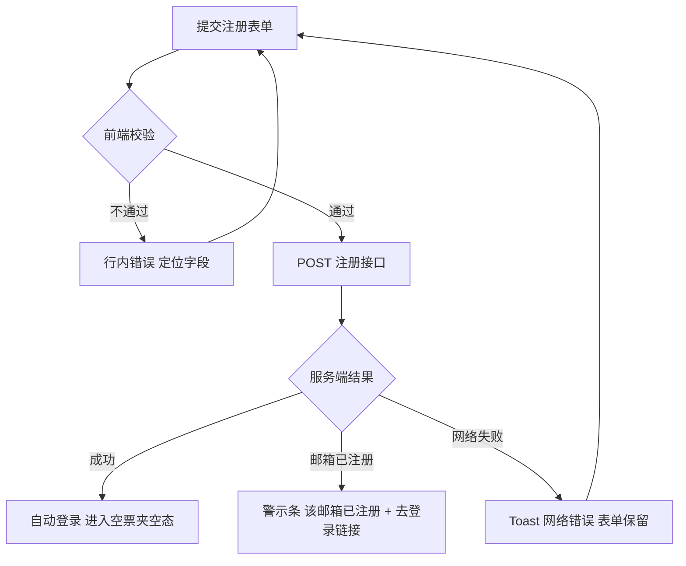
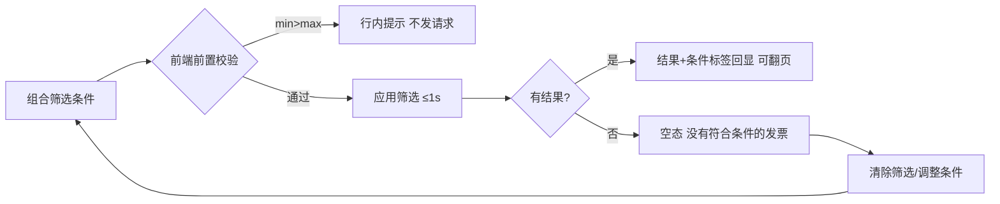
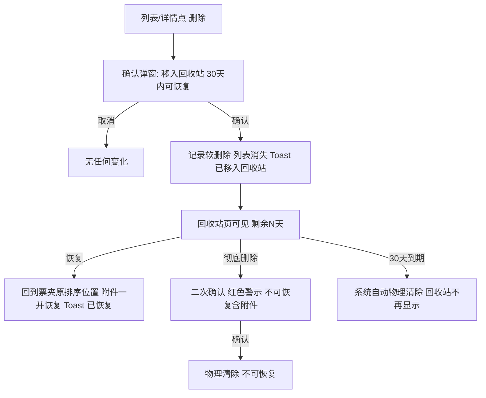

# 交互流程 —— 票夹通（TicketWallet）

> 文档版本：v1.0 ｜ 撰写日期：2026-09-14 ｜ 撰写角色：designer（UI/UX 设计师） ｜ 状态：待评审
> 上游依据：`01_product/user-stories.md`（US01–US15、J1–J4）、`01_product/features.md` §3 验收标准、`./pages.md`（P01–P08）
> 本文定义关键路径的正常流与异常流（网络失败、数据为空、操作冲突）及兜底设计；埋点名与 features.md 保持一致。

---

## 1. 背景

票夹通的三个高频动作是「录入、检索、导出」，两个高风险动作是「删除、彻底删除」。交互设计的分工原则：**高频动作追求零等待感，高风险动作强制确认并写明后果**。本文档以 R1–R10 十条流程覆盖全部核心故事与旅程，每条流程给出正常路径、异常分支与兜底方案；异常分支直接映射 features.md 的验收条目，供 tech 抽 E2E 用例。

## 2. 反馈通道与通用规则

### 2.1 反馈通道分工（唯一口径）

| 通道 | 用于 | 自动消失 |
| --- | --- | --- |
| 行内错误（字段下红字） | 输入校验失败 | 修正后实时消失 |
| Toast | 保存/删除/恢复/导出等动作结果反馈、网络错误 | 成功 4s / 错误 8s |
| 确认弹窗 | 不可逆或高影响动作（删除、彻底删除、放弃未保存表单、导出超限说明） | 不自动，需显式选择 |
| 整页状态 | 列表/汇总加载失败、404、不存在 | 不自动，提供重试 |

### 2.2 通用规则

1. **防重复提交**：所有写操作按钮点击后立即进入 loading 并禁用，直至响应返回。
2. **校验时机**：失焦（blur）即时单字段校验；提交时全量校验；金额区间在输入完成（blur 或回车）时即比对 min ≤ max。
3. **不丢数据**：任何提交失败（含断网）后表单内容保留在内存/本地暂存，重试时原样回填（US04 异常）。
4. **埋点挂点**：每个动作的成败埋点在交互定义处标注（如 `invoice_create_fail{reason:network}`），tech 按此埋点。
5. **加载反馈分级**：≤300ms 不显示 loading（避免闪烁）；300ms–2s 骨架屏；>2s 骨架屏 + 「加载较慢」提示。

## 3. 关键交互流程

### R1 注册与首次进入（US01 / J1）

**正常流**：打开 `/register` → 填账号 + 密码 ×2 → 「注册并进入」→ 校验通过 → 自动登录 → 跳 `/invoices` 空态（首录引导）→ 点「＋新增发票」进入 R3。

| 异常 | 界面行为 | 兜底 |
| --- | --- | --- |
| 密码不合规/格式错误 | 行内红字，不发起请求 | — |
| 重复注册 | 表单顶部警示条 +「去登录」一键跳转 | 老用户走登录进入同一空态流程 |
| 断网 | Toast「网络不给力，请重试」，表单保留 | 联网后原样重试 |

### R2 登录（US02 / J2-J4）

**正常流**：输入账号密码 → 登录 → 跳转票夹列表（或回跳原 URL）。

| 步骤 | 异常 | 界面行为 | 兜底 |
| --- | --- | --- | --- |
| 提交 | 密码错误 | Toast「账号或密码错误」（不指明哪个字段） | 用户重试；连续失败计数服务端维护 |
| 提交 ×5 后 | 账号锁定 | 第 6 次起警示 Toast「账号已锁定，请 10 分钟后重试」，登录按钮禁用并显示剩余等待 | 10 分钟后自动解锁；期间可看客服入口 |
| 访问受保护页 | 未登录 | 302 → `/login?redirect=原URL` | 登录成功回跳原页面（F02 验收） |
| 登录态中 | 后退键/过期会话 | 不展示任何发票数据，重新跳登录（F03 验收） | 7 天会话到期自动失效 |

### R3 录入/编辑发票（US04/US05 / J1 核心流程，G1）

**正常流**（对应 J1 步骤 3–5）：打开表单（日期=今天、状态=正常）→ 填抬头（联想 F15）→ 号码 → 金额 → 税额 → **价税合计实时只读刷新**（每次输入变化即重算，无需失焦）→ 选票种/介质 → 保存 → Toast「已保存」→ 返回列表并滚动到新记录的排序位置。

**校验矩阵**（全部前端即时拦截，不发请求）：

| 字段 | 规则 | 提示文案 |
| --- | --- | --- |
| 开票日期 | 必填且 ≤ 今天 | 「开票日期不能晚于今天」 |
| 抬头 | 必填 1–100 字 | 「请输入抬头」 |
| 发票号码 | 必填 8–20 位数字 | 「发票号码需为 8–20 位数字」 |
| 发票代码 | 选填 ≤20 位数字/字母 | 「发票代码格式不正确」 |
| 金额 | >0，两位小数 | 「金额必须大于 0」 |
| 税额 | ≥0，两位小数 | 「税额不能为负数」 |
| 票种/介质/状态 | 必选 | 「请选择{字段}」 |

**异常流**：
- 提交时断网/服务错误 → Toast「保存失败，请检查网络后重试」，表单全量保留，重试按钮即原表单再次提交（`invoice_create_fail{reason:network}`）。
- 编辑态保存失败 → 同上；成功后返回详情页，列表与详情即时反映新值，保留创建时间、更新「更新时间」（F05）。
- **未保存离开**：点「取消」/浏览器返回且表单有改动 → 确认弹窗「有未保存的内容，确定离开？」（离开 / 留下）；未改动则直接离开。
- 抬头联想（F15，M2 Could）：输入 ≥2 字触发本人历史抬头下拉；点选填入；ESC 关闭；不阻断手输新抬头。

### R4 筛选检索（US07/US08 / J2，G2）

**正常流**：在列表页筛选区组合条件（月份/抬头/金额区间/类型多选/状态多选）→ 点「筛选」→ 结果区 ≤1s 刷新 → 生效条件以标签回显 → 翻页（条件保持）→ 需要时「清除筛选」复位全量。

**异常与兜底**：

| 异常 | 界面行为 | 兜底 |
| --- | --- | --- |
| 金额区间 min>max | 行内红字「最小金额不能大于最大金额」，不发起查询 | 用户改值后重试 |
| 无结果 | 筛选无果型空态 +「清除筛选」主按钮 | 一键复位（F08 验收） |
| 查询超时/失败 | 结果区整页错误态 + 重试 | 保留已选条件（重试不需要重填） |
| 翻页 | 条件与页码都在 URL query 中（`?month=2026-08&title=科技&page=2`） | 刷新/分享链接不丢上下文 |

**操作冲突**（筛选生效期间新增/删除记录）：任何写操作成功后自动以当前条件重新拉取列表，计数标签同步刷新，避免「删了还在数」。

### R5 删除 → 回收站 → 恢复/彻底删除（US11 / J3）

**异常与兜底**：
- 恢复失败（网络）→ Toast「恢复失败，请重试」，记录仍在回收站、天数继续倒计时。
- 剩余天数 ≤7 天 → 天数文字转警示橙并加图标，提示「即将到期」。
- 删除动作的确认弹窗明确写「移入回收站，30 天内可恢复」；而回收站的「彻底删除」弹窗写「删除后不可恢复，附件同时清除」——两级文案刻意不同（术语表口径）。

### R6 CSV 导出（US10 / J2，G3）

**正常流**：列表页「导出当前筛选」或汇总页「导出明细」→ 浏览器下载 `票夹通导出_YYYYMMDD_HHmmss.csv` → Toast「导出成功」。

| 异常 | 界面行为 | 兜底 |
| --- | --- | --- |
| 结果 >5000 条 | 预检查数，警示弹窗「超过单次导出上限 5000 条，请缩小筛选范围」，不发起下载 | 弹窗内提供「去按月筛选」引导（跳列表并打开月份选择） |
| 导出中断网/失败 | Toast「导出失败，请重试」 | 重试入口；不产生半截文件 |
| 无筛选导出 | 提示范围=全量（≤5000） | 直接导出 |

规则：CSV 内容不脱敏（本人导出场景，design-spec §6.2）；导出按钮带 loading 防重复下载。

### R7 附件上传（US13 / F11）

**正常流**：表单/详情附件区点「上传」或拖拽 → 逐项显示进度条 → 完成出缩略图（PDF 显示文件行）→ 可单独删除。

| 异常 | 拦截时机 | 界面行为 | 兜底 |
| --- | --- | --- | --- |
| 单文件 >10MB | 选择后即时 | Toast「单个附件不能超过 10MB」，不上传 | 换文件 |
| 第 4 个附件 | 入口前置 | 满 3 个后上传入口置灰 + 说明「每条发票最多 3 个附件」 | 先删再传 |
| 格式不支持（.zip 等） | 选择后即时 | Toast「仅支持图片（jpg/png/webp）或 PDF」 | 换文件 |
| 上传中断网 | 传输中 | 该项标红 +「重试」按钮；**记录本体与其他附件不受影响** | 联网重传该项 |
| 删除附件 | 点击后 | 轻确认（Toast 式撤销不做，直接删 + 可重新上传） | — |

### R8 敏感信息显示切换（US12 / F13，G4）

- 列表默认：发票号码 `****5678`，抬头与金额完整（Q2 回签，design-spec §6）。
- 点击眼睛 → 全部号码完整显示；再点切回。偏好写入本地（`pref_show_sensitive`），下次进入沿用。
- 顶栏账号标识始终脱敏（`138****1234` / `a***@x.com`），无切换。
- 详情页与 CSV 导出永远完整（已登录本人）。

### R9 会话与安全全局拦截（US03 / J4）

| 场景 | 界面行为 |
| --- | --- |
| 任意页面收到 401 | Toast「登录已过期，请重新登录」→ 1s 后跳 `/login?redirect=当前URL` |
| 点击「退出」 | 账号菜单内一步可达；退出后回登录页 |
| 退出后按浏览器后退 | 不展示任何发票数据，重定向登录页（F03 验收） |
| 网络断开（offline 事件） | 顶部常驻警示条「网络已断开」，恢复后自动消失 |
| 直击他人记录 URL | 「记录不存在或已删除」整页态（防存在性探测） |

### R10 汇总页口径解释（US09 / F09，DP2）

- 打开 `/stats` 自动加载本月/本年卡片与四象限分布。
- 卡片旁「口径说明」可展开折叠，静态文案：**「有效金额 = 正常票金额 + 红冲票（负数）冲减；作废票只计张数、不计金额。」**（口径 A3 的界面翻译）
- 红冲使有效金额为负时正常显示负数（`-2,000.00` 红色），不做特殊隐藏。
- 无数据 → 0 值 + 空分布图 + 「暂无开票记录」，不报错（F09 验收）。

## 4. 异常与兜底总表（对 features.md 验收条目的覆盖反查）

| 功能 | 异常场景 | 设计响应 | 覆盖流程 |
| --- | --- | --- | --- |
| F01/F02 | 格式错、重复注册、密码错、锁定 | 行内/警示条/Toast/按钮禁用+倒计时 | R1、R2 |
| F03/F13 | 后退再现、旁窥 | 会话失效重定向；号码默认掩码 | R8、R9 |
| F04/F05 | 校验失败、断网、未保存离开 | 行内错误、表单保留、离开确认 | R3 |
| F07/F08 | 无结果、min>max、翻页丢条件、查询失败 | 两型空态、前置拦截、URL query、错误重试 | R4 |
| F09 | 无数据、负数金额 | 0 值空图、负数正常渲染+口径说明 | R10 |
| F10 | 超 5000、导出失败 | 预检弹窗、失败重试 | R6 |
| F11 | 超大小/超数量/格式/断网 | 即时拦截、置灰、单项重试 | R7 |
| F06/F12 | 误删、到期、彻底删除 | 二次确认（两级文案）、剩余天数预警、恢复失败重试 | R5 |
| 横切 | 401、offline、越权 | 全局跳转、警示条、不存在态 | R9 |

## 5. 验收标准与后续行动

### 5.1 验收标准

- [x] R1–R10 覆盖 US01–US13 与 J1–J4 全部正常路径与已定义异常路径
- [x] 每条异常给出界面行为 + 兜底方案，可直接转化为 E2E 断言
- [x] 反馈通道分工唯一（行内/Toast/弹窗/整页），无混用
- [x] 高风险动作（删除、彻底删除、放弃表单）均有确认与后果文案
- [x] 埋点名与 features.md §3 一致

### 5.2 后续行动

1. tech 依据 R1–R10 编写 E2E 用例骨架，异常分支按 §3 表格逐条断言。
2. support 依据 §3 文案表预写 FAQ（保存失败重试、导出超限、锁定 10 分钟说明）。
3. Q1（忘记密码）若纳入 M2，需新增 R11 找回密码流程（邮箱/短信验证码方案由 pm+tech 联合定义）。
4. F15 联想与 F14 空态为 Could 级，若 M2 工期不足可降级，不影响本流程其余部分。
