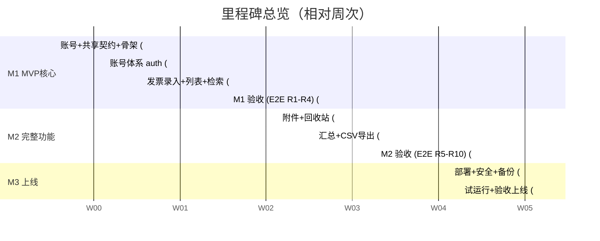

# 工程计划 —— 票夹通（TicketWallet）

> 文档版本：v1.0 ｜ 撰写日期：2026-09-14 ｜ 撰写角色：tech（技术负责人） ｜ 状态：待评审
> 上游依据：`00_charter/charter.md`（M1–M3）、`01_product/features.md` §2（里程碑映射）、`02_design/interactions.md` R1–R10、`03_engineering/tech-stack.md`/`architecture.md`/`repo-layout.md`/`api-design.md`
> 下游读者：开发实施会话（按里程碑领取）、qa（测试策略）、ops（部署与容灾）、support（回滚期间的口径）

---

## 1. 背景

票夹通的开发节奏是「多会话接力 + 里程碑验收」：M0（本流程）产出文档与脚手架后，M1/M2/M3 由后续开发会话按模块认领实施。工程计划的核心目标：**每个里程碑有明确的完成定义（DoD）、每段工时有可验证的交付物、出问题时有兜底与回滚路径**。排期以「工作日相对周次」表达（W1 = M1 启动后第 1 周），不绑定具体日历日。

## 2. 里程碑排期

### 2.1 总览

### 2.2 里程碑任务分解与 DoD

| 里程碑 | 周次 | 任务 | 完成定义（DoD，可勾验） |
| --- | --- | --- | --- |
| **M0（已完成）** | — | 六阶段文档 + 脚手架目录 | 本套 5 份工程文档 + scaffold/ 目录物化 |
| **M1 MVP 核心** | W1 | ① `packages/shared`：zod schema/错误码/事件字典；② `infra`：Prisma schema（users/sessions/invoices）+ 迁移；③ `modules/auth` 全部 4 接口；④ web 骨架：路由表+守卫+7 个通用组件+Tokens 样式；⑤ 登录/注册页（R1/R2 全异常路径） | 注册→登录→登出 E2E 绿；锁定 10 分钟用例绿（Supertest）；`AUTH_001~005` 断言齐全 |
| | W2 | ① `modules/invoices`：POST/GET 列表五维筛选/GET 详情；② 录入表单（11 字段、blur+提交双校验、价税合计实时、断网草稿）；③ 列表页（URL query 同步、脱敏眼睛切换、空态两型、移动卡片/桌面表格）；④ 越权与 G2 性能用例 | **R3/R4 E2E 绿**；1000 条种子数据下组合筛选 P95 <500ms（脚本实测）；用户 A 查不到 B 数据（ownership.spec 绿）；G1 可用性走查 ≤2min |
| **M2 完整功能** | W3 | ① `attachments` 模块+StorageService 本地实现（三校验+进度+单项重试）；② `recycle` 模块（软删/恢复/彻底删/每小时清理 cron）；③ 编辑页（F05） | R5/R7 E2E 绿；30 天到期清理单测（时间 mock）绿；附件恢复联动用例绿 |
| | W4 | ① `stats` 模块（口径 A3 单点）+汇总页+四象限条形；② CSV 导出（预检/流式/BOM/文件名）；③ F14 空态引导、F15 抬头联想（Could，工期富余才做）；④ 埋点接入全量 | **R6/R8/R10 E2E 绿**；口径用例（正常8+红冲1+作废1=10张/38,000元）断言绿；Excel 打开 CSV 不乱码人工核验 |
| **M3 上线** | W5 | ① deploy/ 启用（Compose 四容器+Caddy TLS+域名）；② 备份 cron（pg_dump+附件 rsync 异机）；③ 健康检查+拨测+告警通道；④ 安全清单核验（HTTPS 抓包、依赖 CVE 扫描、默认掩码走查） | 生产 URL 全功能冒烟绿；备份恢复演练一次成功；99.5% 可用性拨测基线建立 |
| | W6 | ① 7 天试运行（真实数据录入+性能观测）；② 修复试运行问题；③ 验收会（章程 G1–G5 逐条）与上线签发 | G1–G5 验收记录归档；遗留项进 issue 池 |

**并行与依赖**：shared 契约先行（W1 上半周），此后前后端可双线并行（接口契约即 api-design.md）；M2 的 attachments 与 stats 无相互依赖可并行；deploy 编排可在 W2 起用开发环境预演，M3 只做生产切换。

### 2.3 里程碑出口验收（与章程对齐）

- M1：G1（录入 ≤2min 走查）、G2（1000 条筛选 ≤1s 实测）、G4 基线（隔离/HTTPS/掩码）；
- M2：G3（汇总口径断言 + CSV 不乱码）+ features.md §3 全部 Must/Should 逐条勾验；
- M3：G5 收口（可部署产物 + 运行手册）。

## 3. Git 分支策略

采用**主干开发（trunk-based）+ 短命特性分支**：

| 分支 | 用途 | 规则 |
| --- | --- | --- |
| `main` | 唯一长期分支，随时可部署 | 保护：禁止 push，仅 PR 合入；CI 全绿是合并前置；打 tag `v{里程碑}.{序号}`（如 v1.0.0=M1 首个验收版） |
| `feat/{module}-{topic}` | 功能分支 | 生命周期 ≤3 天，例如 `feat/auth-lockout`、`feat/invoices-filter`、`feat/web-invoice-form`；从 main 拉出， squash merge 回 main |
| `fix/{issue}` | 缺陷分支 | 同上，关联 issue 号 |
| `release/{tag}`（仅 M3 起） | 上线隔离 | 从 main 拉，只允许 cherry-pick 修复；上线后回合 main |

约定：commit message 用 Conventional Commits（`feat(invoices): 五维筛选 OR/AND 组装`）；**每个 PR 对应 features.md 至少一条验收编号**（PR 描述列 Given/When/Then），评审即验收预演。不采用 Git Flow——单人接力 + 周级里程碑下 develop/release 双长分支是无谓开销。

## 4. 测试策略

### 4.1 分层与目标

| 层 | 工具 | 范围 | 目标 |
| --- | --- | --- | --- |
| 单测 | Vitest | shared schema、口径 A3 计算、脱敏/金额工具、CSV 转义、剩余天数计算 | 行覆盖 ≥80%（shared 与业务 service） |
| 集成 | Supertest + 独立测试库（每用例 truncate） | api-design.md §4 全接口 + 错误码断言 + **越权矩阵** | 每个 code 至少 1 个用例；P0 接口（auth/invoices）用例全覆盖 |
| E2E | Playwright（chromium/webkit，375px 与 1280px 双视口） | R1–R10 全流程含异常分支 | R1–R10 每条 ≥1 绿 |
| 性能 | k6（或 Playwright trace 计时）脚本 | 1000 条种子数据组合筛选 | P95 <500ms，通过阈值进 CI 可选（夜间跑） |

### 4.2 E2E 用例映射（interactions R1–R10 → spec 文件）

| 流程 | spec | 必含异常断言（interactions §3 表格直译） |
| --- | --- | --- |
| R1 注册 | `r1-register.spec.ts` | 密码不合规不发请求（网络 stub 断言 0 请求）、重复注册警示条、断网表单保留 |
| R2 登录 | `r2-login.spec.ts` | 密码错误统一文案、第 6 次锁定禁用按钮+剩余分钟、302 回跳 `?redirect=` |
| R3 录入/编辑 | `r3-invoice-form.spec.ts` | 校验矩阵逐字段、断网草稿重试回填、未保存离开确认弹窗、价税合计实时 |
| R4 筛选 | `r4-filter.spec.ts` | min>max 前置拦截、无结果空态、翻页条件保持（URL query 断言）、查询失败重试不丢条件 |
| R5 回收站 | `r5-recycle.spec.ts` | 两级删除确认文案不同、恢复回原位、剩余 ≤7 天警示色 |
| R6 导出 | `r6-export.spec.ts` | >5000 预检弹窗不下载、文件名格式、BOM 首字节、26 行计数 |
| R7 附件 | `r7-attachments.spec.ts` | 15MB 拒、第 4 个置灰、.zip 拒、单项失败重试且其他不受影响 |
| R8 脱敏 | `r8-masking.spec.ts` | 默认 `****5678`、切换记忆（localStorage `pref_show_sensitive`）、顶栏账号掩码 |
| R9 会话 | `r9-session.spec.ts` | 401 全局跳转、登出后后退无数据、offline 警示条 |
| R10 汇总 | `r10-stats.spec.ts` | 口径数字断言（38,000 案例）、负数红色、空数据 0 值 |

### 4.3 质量门禁（CI 必过）

`lint（eslint+prettier）→ typecheck（tsc --noEmit）→ unit → integration → build`；E2E 在 PR 触发 smoke 子集（R2/R3/R4），全量 R1–R10 每晚定时跑 main。**安全测试固定项**：ownership 越权矩阵（4 资源 × 2 用户）、会话过期、上传魔数绕过尝试，任一红即阻塞合并。

## 5. CI/CD

- **CI**：GitHub Actions（或等价）三 job（web/server/shared 并行），缓存 pnpm store；
- **CD（M3 起）**：main tag 推送 → 构建 api/web 镜像 → SSH 到单机 `docker compose pull && up -d` → 拨测 `/health` 30s 不通则自动回退上一镜像 tag（见 §6.2 回滚）；
- 开发环境：`docker compose -f deploy/compose.yaml --profile dev`（本地 HTTP + 热重载卷）。

## 6. 技术兜底方案

### 6.1 功能降级预案

| 场景 | 降级动作 | 用户感知 |
| --- | --- | --- |
| 附件上传故障（磁盘满/写入失败） | 记录本体保存不受影响，附件区提示「暂不可上传，稍后重试」；结构化台账是主链路（R7 已按单项失败设计） | 可先录票后补附件 |
| CSV 导出超时/失败 | 前端 Toast+重试入口；不产生半截文件（服务端先 count 后流式，失败即断流） | 重试即可，无脏文件 |
| F15 抬头联想故障/降级 | 接口空返回，前端不渲染下拉，手输不受阻（Could 级功能可整体下线） | 无感 |
| 埋点上报失败 | sendBeacon 静默丢弃，不做重试队列（数据价值不抵复杂度） | 无感 |
| 数据库连接抖动 | 健康检查 503 → 拨测告警；API 返回 SYS_002 文案 | 明确提示稍后重试，表单草稿保留 |
| Q1 忘记密码未上线期间的账号找回 | support 人工核验后走运维脚本重置（留运行手册），M2 评估产品化（API 已预留 AUTH_006+） | 客服通道 |

### 6.2 回滚方案

1. **应用回滚**：镜像按 git tag 构建（`api:{tag}`），生产保留最近 3 个 tag；`docker compose` 指定回退 tag + `/health` 验证，目标 RTO ≤5 分钟；
2. **数据回滚**：Prisma 迁移遵循「先备份后迁移」——每次部署前自动 `pg_dump`；迁移失败用 `prisma migrate resolve` 标记 + 恢复对应 dump（RPO ≤24h，见备份策略）；**生产禁用 `db push`**；
3. **配置回滚**：Caddyfile/.env 变更纳入 git 版本化，回滚即 checkout 历史版本重新渲染；
4. 回滚决策口径：P0（登录/录入/列表不可用）且 15 分钟内无法修复 → 立即回滚上一 tag；P1（附件/导出）→ 降级运行 + 当日修复。

### 6.3 容灾与数据安全

| 项 | 方案 |
| --- | --- |
| 备份 | 每日 02:00（东八区）`pg_dump` + 附件卷 rsync → 异机/对象存储，保留 14 份；**每季度恢复演练**（M3 首演） |
| 单机故障 | Compose 一键重建（infra as code 全在 deploy/）；数据以最近备份恢复，RPO ≤24h、RTO ≤2h（个人工具可接受阈值，写入运维手册） |
| 附件防误删 | 回收站物理清除先删文件后删行（architecture §6.5），孤儿文件由对账 cron 兜底；备份含附件卷 |
| 密钥管理 | `.env`（session 盐/DB 口令）不入库（.gitignore 白名单校验进 CI）；泄露处置=轮换 DB 口令+全量 session 失效（强制重登） |
| 依赖风险 | 每周 `pnpm audit`；CVE 高危 48h 内升级或评估 pin |

## 7. 风险登记（Top 风险与应对）

| 风险 | 概率/影响 | 应对 |
| --- | --- | --- |
| 多会话接力导致风格漂移 | 高/中 | shared 契约+目录纪律（repo-layout §5）+ PR 必须关联验收编号 |
| 微信内置浏览器兼容差异（WebView cookie/日期控件） | 中/高 | M1 E2E 加 webkit 视口；日期控件自建（不用原生 input type=date 的不一致行为，IA 表单设计已按自定义控件） |
| G2 在低端移动网络不达标 | 低/中 | 列表响应瘦身（掩码号/列表字段子集）+ 分页 20 条；实测量级余量大（§5.3 论证） |
| 单人接力总线风险（知识集中） | 中/中 | 本套文档+运行手册即交接包；每个里程碑 DoD 可勾验 |

## 8. 验收标准与后续行动

### 8.1 验收标准

- [x] M1–M3 任务分解到周级，每段有可勾验 DoD，出口对齐 G1–G5 与 features 验收
- [x] 分支策略、质量门禁、CI/CD 链路完整（trunk-based + PR 关联验收编号）
- [x] R1–R10 → E2E spec 映射表可直接建文件（`apps/web/tests/e2e/`）
- [x] 降级/回滚/容灾三层兜底齐备，含 RTO/RPO 与回滚决策口径

### 8.2 后续行动

1. M1 开工会话按 §2.2 W1 任务卡启动（shared 契约先行）；
2. qa 按本文 §4.2 表初始化 E2E 骨架文件（占位 spec 挂 `test.skip` 逐步点亮）；
3. ops 在 M3 前依 §6.3 准备备份脚本与恢复演练手册；support 依 §6.1 降级口径预写 FAQ。
