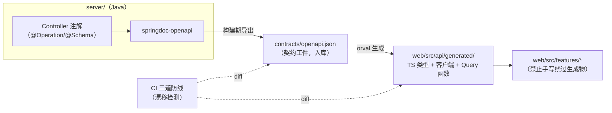

# 技术选型 —— 票夹通（TicketWallet）

> 文档版本：v2.0 ｜ 撰写日期：2026-09-14 ｜ 撰写角色：tech（技术负责人） ｜ 状态：待评审
> **v2.0：技术栈变更重跑（2026-09-15，用户决策 D6）**——后端由 NestJS/Prisma 变更为 Spring Boot 4.1.1 + MyBatis-Flex 1.11.8 + JDK 25（LTS），契约机制由前后端 TS 同构 + zod 三端共享变更为 **OpenAPI 3 单一契约源**；前端（React 18 + Vite + TS + Tailwind）、数据库（PostgreSQL 16）、入口（Caddy 2）保持不变，v1.0 全部业务语义与安全决策继承。
> 上游依据：`00_charter/charter.md` G1–G5、`01_product/PRD.md` §5–§7、`01_product/features.md` F01–F15、`02_design/design-spec.md` §4/§6
> 下游读者：开发实施会话（M1–M3）、ops（部署）、support（故障排查口径）

---

## 1. 背景

票夹通是**单用户私有的网页版销项发票台账**：数据量小（单账号 ≤ 数千条）、写频低（月均 1–200 条）、读频高（筛选检索 ≤1s）、敏感度高（发票号码/金额/账号标识）。产品形态为响应式 Web App（桌面 ≥1024 / 移动 <768），里程碑 M1（账号+录入+列表+检索）→ M2（汇总+导出+附件+回收站）→ M3（上线）。

技术选型的总约束（v1.0 沿用，第 6 条为本版新增强化）：

1. **规模约束**：个人/小微场景，绝不引入分布式、微服务、消息队列等想象规模复杂度；
2. **安全约束**（G4）：HTTPS 全站、密码不可逆存储、服务端会话可控失效、数据按账号强制隔离；
3. **性能约束**（G2）：1000 条内筛选 ≤1s——单机 PG 加正确索引即可满足，**不引入缓存层**；
4. **交付约束**（G5/M0）：脚手架必须能被后续开发会话直接物化，选型需「约定大于配置」；
5. **现金流约束**：全链路零许可费，单机月成本 ≤ ¥50（约等于国内轻量云 2C2G 档位），**JVM 内存与镜像体积必须纳入预算**；
6. **多会话接力约束（本版关键）**：项目由多个 AI 开发会话接力实施。v1.0 依赖前后端同语言共享 zod schema 消除契约漂移；换 Java 后端后该机制失效，**必须以 OpenAPI 3 规范重建「单一契约源 + 自动生成 + CI 漂移检测」**（§7），这是本版选型的第一优先事项。

### 1.1 v1.0 → v2.0 变更清单

| 领域 | v1.0 | v2.0 | 变更性质 |
| --- | --- | --- | --- |
| 后端运行时 | Node.js + NestJS 10 + TS | **JDK 25（LTS）+ Spring Boot 4.1.1** | 用户决策 D6，不可更改 |
| 后端 ORM | Prisma 5 | **MyBatis-Flex 1.11.8** | 用户决策 D6 |
| 构建工具 | pnpm + nest-cli | **Maven（本文 §3.2 论证选定）** | tech 论证 |
| 会话实现 | 自建 sessions 表 + Guard | **Spring Session JDBC**（等价语义，§3.4 论证） | 语义继承、实现替换 |
| 密码哈希 | argon2id（node-argon2） | **Argon2PasswordEncoder（Bouncy Castle）**，BCrypt 降级 | 语义继承、实现替换 |
| 数据库迁移 | Prisma Migrate | **Flyway（SQL 直写）** | 等价能力替换 |
| 契约机制 | packages/shared + zod 三端共享 | **OpenAPI 3 单一契约源（springdoc → orval）** | 机制重建（§7） |
| 前端 / 数据库 / 入口 | React 18 / PG 16 / Caddy 2 | 不变 | — |
| 架构形态 | 单机单体 + Docker Compose | 不变 | D6 继承 |

## 2. 选型原则

| # | 原则 | v2.0 说明 |
| --- | --- | --- |
| T1 | 单体优先 | 一个前端应用 + 一个后端应用 + 一个 PG 实例 + 本地附件卷，Compose 单机部署 |
| T2 | **契约贯穿** | 前后端语言异构后，类型贯通改由 **OpenAPI 3 规范**承担：后端注解生成 → 契约工件入库 → 前端 orval 生成类型与客户端 → CI 三道防线检测漂移（§7） |
| T3 | 少依赖、长支持 | Java 侧依赖收敛于 Spring 官方 starter + MyBatis-Flex + Flyway + springdoc + Bouncy Castle 五族 + Lombok（D7：仅实体层 compile-time，1.18.48 × JDK 25 已实测）；组件自建为主（7 个通用组件不引入组件库） |
| T4 | 可降级 | 每个关键组件给出降级路径（§9 与 engineering-plan §6）：argon2→bcrypt、QueryWrapper→注解 SQL、JDK 25→21 回退、本地盘→S3 抽象 |
| T5 | 现金流友好 | 月成本 ≤¥50：2C2G 单机预算表见 §6.2，JVM 堆与镜像体积是硬预算项 |

## 3. 后端选型（Java 侧，本版核心）

### 3.1 运行时与框架：JDK 25（LTS）+ Spring Boot 4.1.1（D6 拍板）

- **决策**：JDK 25（2025-09 起的 LTS 线）作为编译与运行时；Spring Boot 4.1.1 作为应用框架（Spring MVC 同步阻塞栈，内嵌 Tomcat）。
- **理由**：
  1. 用户决策 D6 指定，版本以此为准；
  2. LTS 线保证至下一 LTS 前的持续安全补丁，避免追赶非 LTS 的短期升级节奏；
  3. Spring MVC 同步栈对本项目写频低、无长连接诉求的负载足够（P95 <500ms 预算余量极大），无需 WebFlux 反应式复杂度；
  4. Spring 生态的 Security/Session/事务/Actuator/测试矩阵（§3.4–§3.10）能直接兑现 v1.0 的安全与运维语义。
- **风险标注**：~~Spring Boot 4.x 与 JDK 25 的组合需 W1 spike 验证~~ → **✅ 已验证通过（2026-09-16，`SPIKE-W1D1.md`）**：五项冒烟全绿（启动 2.4s / RSS 39MB / jar 32MB），JDK 21 回退位保留不启用。Boot 4 的具体新特性本文不预设，凡引用「Boot 3 时代已有」的稳定机制处若在 4.x 有 API 变化，以官方迁移指南为准（全文以「待核实」显式标注，见 §9 风险表 R1）。

### 3.2 构建工具：Maven（论证选定）

- **决策**：**Maven**（经 Maven Wrapper `mvnw` 锁定版本），放弃 Gradle。
- **理由（按重要性排序）**：
  1. **多会话确定性（T6 考量）**：`pom.xml` 是纯声明式 XML，无逻辑分支，任何 AI 会话生成的构建脚本都收敛到同一形态；Gradle Kotlin DSL 的自由度（buildSrc、自定义 task、版本目录写法多样）在接力开发中会积累风格漂移，违背「约定大于配置」；
  2. **版本对齐简单**：继承 `spring-boot-starter-parent` 4.1.1 一处对齐全族依赖版本，JDK 25 由 `<java.version>25</java.version>` 一处声明；
  3. **官方插件链完整**：`spring-boot-maven-plugin`（分层 jar、start/stop 集成测试拉起）与 `springdoc-openapi-maven-plugin`（构建期导出 OpenAPI 契约，§7 关键环节）在 Maven 侧的文档与示例最完整；
  4. **性能劣势不可感知**：单模块小项目（六业务包、百级类），Gradle 的增量构建与构建缓存收益无法兑现，而其学习与排查成本（daemon 失联、缓存损坏）对本项目是纯负担。
- **备选与取舍**：Gradle 9.x（Kotlin DSL）——增量编译与大型多模块构建优势明显，但需要 Gradle 9 对 JDK 25 的兼容确认【待核实】，且 DSL 漂移风险高，放弃。若未来后端拆为多模块且构建时间成为瓶颈，可再评估迁移。

### 3.3 ORM / 数据访问：MyBatis-Flex 1.11.8（D6 拍板）

- **决策**：MyBatis-Flex 1.11.8（其 flex-spring-boot-starter 接入），配合 Flyway 管理 DDL。
- **理由**：
  1. **动态筛选贴合 QueryWrapper 模型**：F08 五维筛选（月/抬头 contains/金额区间/类型多选/状态多选，AND 组合、同维 OR）本质是运行时动态拼 WHERE——MyBatis-Flex 的 QueryWrapper/QueryChain 即为此设计，代码量与可读性优于 JPA Criteria 的强类型拼接；
  2. **不屏蔽 SQL，索引可直达**：v1.0 的 G2 方案依赖 PG 部分索引与 pg_trgm GIN（architecture §5.3 继承），Flex 生成的 SQL 直观可控，分页语句走其 PG 方言（LIMIT/OFFSET）；复杂场景（抬头 ILIKE、汇总 CASE WHEN）可退到注解 SQL/`@Select` 手写，不与框架对抗；
  3. **小实体 CRUD 开销低**：六张表的增删改查由 BaseMapper 提供，无需 JPA 的实体生命周期/一级缓存心智；
  4. **轻依赖**：MyBatis-Flex 基于 MyBatis 本体增强，无二级缓存、无延迟加载代理等隐性行为。
- **备选与取舍**：
  - Spring Data JPA：生态第一选择，但 Criteria/Specification 动态查询冗长，pg_trgm/部分索引等 PG 特性仍要 `nativeQuery` 逃生，「一半 ORM 一半手写」对接力会话不友好，放弃；
  - MyBatis-Plus：能力与 Flex 同类，但 D6 已指定 Flex，不再摇摆；
  - jOOQ：类型安全最强，但商用数据库协议下许可证约束与学习成本高，放弃。
- **待核实项**（✅ 已于 M1 W1-D1 spike 回填，2026-09-16，详见 `SPIKE-W1D1.md`）：
  - ① ~~flex starter 对 Boot 4 的适配~~ → **`mybatis-flex-spring-boot4-starter:1.11.8`**（Maven Central 官方存在，自动装配正常）；
  - ② ~~PG 方言 like 大小写行为~~ → 实测 Flex `QueryWrapper.like` 生成 SQL LIKE **大小写敏感**（`invoice` 命中 0），**抬头模糊检索一律走 `@Select` 原生 ILIKE**（pg_trgm GIN 已建）；
  - ③ ~~enum TypeHandler~~ → 默认不兼容（varchar→enum 报错），**JDBC URL 加 `stringtype=unspecified`** 后读写全通，保持 PG enum 类型，无需降级 varchar+CHECK。
  - 附加发现：Boot 4 需 **starter 形态**（`spring-boot-starter-flyway` / `spring-boot-starter-session-jdbc`）才触发自动装配；`spring.session.store-type`/`cookie-name` 已删除（cookie 名走 `server.servlet.session.cookie.name`）；**TIMESTAMPTZ 实体字段必须用 `OffsetDateTime`**（pgjdbc 拒绝 LocalDateTime 读取）。

### 3.4 会话：Spring Session JDBC（弃 JWT 语义继承）

- **决策**：**Spring Session JDBC**（spring-session-jdbc，会话存 PG，由 Caddy 反代的同源 Cookie 携带）。
- **理由（对照 v1.0「自建 session 表 + 删行即失效」语义逐条兑现）**：
  1. **登出即删行立即失效**：Spring Security 登出流程对 session 执行 invalidate，Spring Session JDBC 语义即删除数据库行——与 v1.0「登出即删行」完全等价，无 JWT 黑名单问题；
  2. **7 天过期**：`spring.session.timeout` 设 7d，到期行由 Spring Session 内置的清理任务（JDBC cleanup cron，每小时）删除，等价 v1.0 的过期清扫 cron；
  3. **HttpOnly Cookie**：Cookie 名 `tw_session`（对齐 v1.0），`HttpOnly; Secure; SameSite=Lax; Path=/` 由 Spring Session cookie 配置下发；
  4. **官方表结构免维护**：SPRING_SESSION / SPRING_SESSION_ATTRIBUTE 两表由官方 schema 初始化与演进，比 v1.0 自建表少一份自研资产。
- **与 v1.0 的差异说明（显式记录）**：会话 ID 由 Spring Session 默认策略生成（UUID 形态，约 122bit 熵），低于 v1.0 自研的 256bit CSPRNG。在「HTTPS 全站 + HttpOnly + SameSite=Lax + 登录失败锁定 + 每小时过期清扫」防线组合下，会话 ID 被在线猜测不可行，风险可接受；如需恢复 256bit 熵，可替换其 SessionIdGenerator 扩展点【待核实 Boot 4 下的扩展接口】。
- **备选与取舍**：自建 sessions 表 + HandlerInterceptor（v1.0 原方案直译）——语义完全可控但要自维护建表/清扫/并发刷新四处代码；Spring Session JDBC 以同等语义换官方维护，**选定 Spring Session JDBC**，并在 ER 图中保留 users.failed_attempts / locked_until（登录锁定仍在业务表，不由 Spring Session 承担）。

### 3.5 认证与密码哈希：Spring Security + Argon2（BCrypt 降级）

- **决策**：
  1. Spring Security 过滤器链只承担**登录态识别与登出**两件事（Session 识别 → `Authentication` 注入 Controller；logout → 删 session 行）；其余接口授权用「登录 + 属主谓词」由 §3.5.2 的统一纪律实现；
  2. 密码哈希 **Argon2PasswordEncoder**（spring-security-crypto，底层 Bouncy Castle 纯 Java 实现，无原生编译问题）：argon2id，m=19MiB（19456 KiB）、t=2、p=1、盐 16B、哈希 32B（OWASP 推荐档）；哈希串自带 `$argon2id$` 前缀；
  3. **降级路径**：若 Bouncy Castle 依赖在目标镜像构建或运行异常，切换 `BCryptPasswordEncoder(strength=12)`；哈希串的 `$2b$` 前缀与 argon2 前缀天然可共存识别，支持「登录时渐进式重哈希」——与 v1.0 降级语义一致。
- **CSRF 双保险（契约语义沿用 v1.0）**：① Session Cookie `SameSite=Lax`（浏览器层）；② 自定义 `OncePerRequestFilter`：凡非幂等写方法（POST/PATCH/DELETE）且路径在 `/api/v1` 下，必须携带 `X-Requested-With: XMLHttpRequest` 头，缺失返回 `403`（错误口径进 api-design）。**不启用** Spring Security 默认 CSRF token 机制——那会引入第三套 token 协议并破坏 v1.0 契约（前端从不携带 CSRF token）。
- **登录锁定**：users 表 `failed_attempts` / `locked_until` 字段（ER 继承），连续 5 次失败锁 10 分钟，锁定期间正确密码也拒绝并返回剩余分钟——service 层实现，与框架无关。

### 3.6 数据库迁移：Flyway

- **决策**：Flyway（SQL 文件直写，`db/migration/V*.sql`，随应用启动自动 migrate）。
- **理由**：v1.0 的部分索引、pg_trgm 扩展、PG enum 都是需要**逐字控制**的 DDL，Prisma schema DSL 的抽象层在 Java 侧本就消失；Flyway 的纯 SQL 迁移让 ER 图与索引策略（architecture §5）可 1:1 落地为版本化脚本，且「先备份后迁移」的部署纪律（engineering-plan §6.2）容易执行。
- **备选与取舍**：Liquibase——XML/YAML 变更集对纯 SQL 场景是额外翻译层，放弃。

### 3.7 契约源与 API 文档：springdoc-openapi

- **决策**：springdoc-openapi 从 Controller 注解生成 OpenAPI 3 规范，构建期经 `springdoc-openapi-maven-plugin`（集成测试阶段应用拉起时抓取 `/v3/api-docs`）导出为静态契约工件 `contracts/openapi.json` 入库（§7 全流程）。
- **待核实**：~~springdoc 对 Spring Boot 4.x 的兼容版本号~~ → **✅ 已核实（W1-D1）**：`springdoc-openapi-starter-webmvc-ui:3.1.1` 面向 Boot 4，`/v3/api-docs` 输出 OpenAPI **3.1.0**（5 paths 实测）；orval 对 3.1 语法的支持在契约链搭建时验证，不支则配置 springdoc 降输出 3.0。若 maven 插件未跟进，降级方案为一条 `@SpringBootTest` + TestRestTemplate 抓取 `/v3/api-docs` 落盘的 JUnit「契约导出器」测试（机制等价、无插件依赖）。

### 3.8 CSV 导出：StreamingResponseBody + BOM

- **决策**：Spring MVC `StreamingResponseBody` 流式输出 `text/csv; charset=utf-8`，首字节写 `\uFEFF` BOM；数据侧按 id 游标分批查询（500 条/批）拼接，≤5000 条上限内存峰值可控；转义（逗号/引号/换行/CRLF）自实现一个 20 行的工具类并以单测锁行为（CSV 注入转义边界：字段含 `,` `"` `\n` 时加引号并双写引号）。
- **备选与取舍**：Apache Commons CSV——为一个转义器引入依赖不值（T3），且自实现可被单测完全钉死；如实现中发现边界遗漏，再引入 Commons CSV 亦是一行替换。

### 3.9 附件上传：Spring multipart + 魔数校验

- **决策**：`spring.servlet.multipart.max-file-size=10MB`（应用层第二道闸，Caddy 15MB 为第一道）；multipart 落临时文件后读取头部字节做魔数嗅探（JPEG `FFD8FF` / PNG `89504E47` / WEBP `RIFF…WEBP` / PDF `%PDF-`）+ 扩展名白名单双校验，通过后经 `StorageService` 抽象写入本地卷。
- **取舍**：与 v1.0 multer 内存接收不同，Java 侧走临时文件（multipart 默认行为），10MB 上限下临时盘占用可忽略；魔数校验逻辑与 v1.0 完全一致。

### 3.10 日志与可观测

- **决策**：logback（Spring Boot 默认）+ logstash-logback-encoder 输出 JSON 结构化日志；`OncePerRequestFilter` 生成/透传 `requestId` 写入 MDC 并回写 `X-Request-Id` 响应头（support 反查口径继承 v1.0）；健康检查为自写 `/api/v1/health` controller（含 DB ping），语义与 v1.0 完全一致，不暴露完整 Actuator 端点到公网。

### 3.11 后端选型汇总表

| 领域 | 决策 | 备选 | 取舍理由 |
| --- | --- | --- | --- |
| 运行时 | JDK 25（LTS） | JDK 21（降级路径） | D6 拍板；21 为回退位 |
| 框架 | Spring Boot 4.1.1（MVC） | WebFlux | 同步栈够用、心智负担低 |
| 构建 | Maven + mvnw | Gradle 9 | 多会话确定性（§3.2） |
| ORM | MyBatis-Flex 1.11.8 | JPA / jOOQ | QueryWrapper 贴合动态筛选；SQL 可控 |
| 会话 | Spring Session JDBC | 自建表 + Filter / JWT | 登出删行语义等价、官方维护 |
| 安全 | Spring Security（登录态/登出）+ X-Requested-With 过滤器 | 默认 CSRF token | 契约语义沿用 v1.0 |
| 密码 | Argon2PasswordEncoder（BCrypt 降级） | — | OWASP 首选；前缀共存支持渐进重哈希 |
| 迁移 | Flyway（SQL 直写） | Liquibase | ER/索引 1:1 落地 |
| 契约 | springdoc-openapi → contracts/openapi.json | 手写 OpenAPI | 注解即文档，漂移由 CI 拦截 |
| CSV | StreamingResponseBody + 自实现转义 | Commons CSV | 流式 + BOM；依赖收敛 |
| 上传 | Spring multipart + 魔数嗅探 | — | 与 v1.0 三道闸纵深一致 |
| 定时 | @Scheduled（Spring 任务调度） | 系统 crontab | 随应用部署、可单测（v1.0 @nestjs/schedule 等价物） |
| 日志 | logback + JSON encoder + MDC requestId | log4j2 | Boot 默认、生态齐 |

## 4. 前端选型（保持不变，契约消费方式更新）

前端技术栈全部沿用 v1.0：React 18 + TypeScript 5（strict）+ Vite + react-router-dom + TanStack Query v5 + react-hook-form + Tailwind（Design Tokens 落 CSS Variables）+ decimal.js + 自建 CSS 条形图 + 自建 sendBeacon 埋点。理由不再重复（见 v1.0 §3 存档语义：生态成熟度、Vite 迭代效率、组件清单 7 件无需组件库）。

**v2.0 变化点仅一处——契约消费方式**：

| 项 | v1.0 | v2.0 |
| --- | --- | --- |
| API 类型来源 | `packages/shared` zod schema 派生 | **orval 从 `contracts/openapi.json` 生成**（`web/src/api/generated/`：TS 类型 + fetch 客户端 + TanStack Query 函数） |
| 表单校验 schema | zod schema 三端共享 | 前端手写 zod schema（`web/src/lib/schemas/`，承载中文行内文案与「≤今天」等前端即时规则），字段名与类型以生成类型为锚做编译期对齐（§7 防线 3） |
| HTTP 客户端 | 自写 fetch 封装 | orval mutator 指向自写 `client.ts`（注入 `credentials: include`、写接口 `X-Requested-With` 头、401 全局跳转、`{data}/{error}` 包络解析）——**包络解析逻辑仍单点手写**，生成代码只做类型与调用形态 |

选 orval 而非 openapi-typescript 的理由：orval 一步生成「类型 + 客户端 + react-query 封装」，与前端 TanStack Query 技术栈直接咬合；openapi-typescript 仅产类型，客户端全部手写会在多会话接力中产生实现漂移。orval 的生成物是代码而非依赖，锁定版本后行为确定。

## 5. 数据库选型：PostgreSQL 16（不变）

决策与 v1.0 完全一致：`numeric(12,2)` 定点金额（A3 汇总口径不容 0.01 漂移）、`ILIKE + pg_trgm GIN` 抬头模糊检索、`deleted_at IS NULL` 部分索引支撑回收站口径隔离、PG enum 二道校验、Compose 单容器、备份即 pg_dump。**ER 图与索引策略原样继承 v1.0**（见 architecture §5），唯一变化是 sessions 表由 Spring Session JDBC 官方表接管（§3.4）与 DDL 载体从 Prisma 换为 Flyway。无缓存层结论不变：读多写少 + 单账号隔离 + user_id 前缀索引即满足 G2，引 Redis 只增加失效一致性维度。

## 6. 基础设施与部署（含 JVM 资源预算）

### 6.1 拓扑组件

| 组件 | 决策 | 说明 |
| --- | --- | --- |
| 运行方式 | Docker Compose：caddy / api（Java）/ postgres 三容器 | web 静态产物构建期注入 Caddy 托管（无独立容器）；单机单命令部署（T1） |
| 入口 | Caddy 2（自动 HTTPS + 静态托管 + 反代 `/api` + body 上限 15MB） | 与 v1.0 一致；Caddyfile 在 deploy/ |
| 附件存储 | 本地卷 `/data/attachments` + StorageService 抽象（put/get/delete） | 演进路径 S3Provider（MinIO/OSS）切换，业务代码零改动 |
| 证书 | Let's Encrypt（Caddy ACME 自动） | 免费（T5） |
| 备份 | 每日 pg_dump + 附件 rsync，保留 14 份异机冷备 | 容灾底线，见 engineering-plan §6.3 |
| 监控 | `/api/v1/health` + 外部拨测（UptimeRobot 免费档）+ JSON 日志落盘 | M3 轻量上线 |

### 6.2 JVM 与镜像预算（¥50/月硬约束下的显式算账）

目标机型：国内轻量云 2C2G（约 ¥50/月档）。内存预算表：

| 进程 | 预算 | 手段 |
| --- | --- | --- |
| Caddy | ~30MB | 官方 alpine 镜像，默认配置 |
| PostgreSQL 16 | ~350MB | `shared_buffers=128MB`、`max_connections=30`（连接池见下） |
| api（JVM） | RSS ≤ 550MB | `-XX:MaxRAMPercentage=60`（容器 768MB limit）+ `-XX:+UseSerialGC`（小堆下停顿与内存footprint 优于 G1）；堆外（Metaspace/线程栈/CodeCache）约 150–200MB |
| 系统 + 页缓存 | 余量 ≥ 600MB | PG 依赖页缓存做 IO |

配套措施：
1. **镜像体积**：多阶段构建（`maven:3.9-eclipse-temurin-25` 构建层 → `eclipse-temurin:25-jre-alpine` 运行层），Spring Boot 分层 jar（layertools extract）让依赖层可缓存；目标 api 镜像 < 350MB（JDK 全量镜像 700MB+ 不可接受）；
2. **连接池**：HikariCP（Boot 默认）`maximum-pool-size=10`，与 PG `max_connections=30` 留余量；
3. **启动内存尖峰**：分层提取与 Flyway migrate 均在堆内完成，无额外峰值；若实测超限，降级手段按序：堆压至 384MB → `SerialGC` 已选 → 开启 CDS/AOT 类数据共享【待核实 Boot 4 对 CDS 的打包支持】；
4. **启动速度**：非核心诉求（无 serverless 冷启动），Compose `restart: unless-stopped` 即可。

## 7. 契约机制：OpenAPI 3 单一契约源（v2.0 核心新增）

### 7.1 机制总览

### 7.2 工具链与流程

| 环节 | 工具 | 动作 | 频次 |
| --- | --- | --- | --- |
| 契约生成 | springdoc-openapi（server 注解）+ springdoc-openapi-maven-plugin | `./mvnw verify -Popenapi-export`：集成测试阶段拉起应用抓取 `/v3/api-docs`，写入 `contracts/openapi.json` | 后端每次接口改动 |
| 契约入库 | Git（contracts/ 目录） | 契约工件随代码 PR 一同提交，PR 评审即契约评审 | 同上 |
| 客户端生成 | orval（web/，`orval.config.ts`） | `pnpm gen:api` 读取 `contracts/openapi.json` → 生成 `web/src/api/generated/` | 契约工件更新后 |
| 客户端入库 | Git | 生成物入库（而非构建时生成），保证任何会话 checkout 即可编译，且 diff 可见 | 同上 |

关键约定：**契约 schema 形态由 server 侧统一**——响应包络 `{data}` 用泛型记录 `ApiResponse<T>` 表达，金额一律 `type: string`（Java 侧 Jackson 将 BigDecimal 全局序列化为两位小数字符串，§api-design §2），日期 `format: date` / 时间 `format: date-time`（ISO 8601 UTC）。前端手写代码只 import 生成类型，不重复声明接口形状。

### 7.3 CI 三道防线（契约漂移检测，多会话接力的护栏）

1. **防线一（server 侧）**：CI 在 `mvn verify` 后重跑 openapi 导出，`git diff --exit-code contracts/openapi.json`——后端改了接口却未更新契约工件（或反向手工篡改契约）即红，提示「运行 `./mvnw verify -Popenapi-export` 同步契约」；
2. **防线二（web 侧）**：CI 重跑 `pnpm gen:api` 后 `git diff --exit-code web/src/api/generated/`——契约工件更新后前端未重新生成即红；
3. **防线三（类型对齐）**：`pnpm typecheck` 中，手写 zod 表单 schema 的输出类型必须可赋值给生成的请求类型（`satisfies` 显式类型断言单测文件），字段名/可选性漂移在编译期拦截。
> 注：orval 若提供 `--check` 模式可直接使用，否则以「重新生成 + git diff --exit-code」等价实现【待核实 orval 当前 CLI 能力】。

## 8. 测试工具

| 层 | 工具 | 覆盖目标 |
| --- | --- | --- |
| Java 单测 | JUnit 5 + AssertJ | 汇总口径 A3 计算、脱敏掩码、金额序列化（BigDecimal→两位小数字符串）、CSV 转义边界、锁定计数、剩余天数 |
| Java 集成 | @SpringBootTest + MockMvc + **Testcontainers（PostgreSQL 16）** | api-design 全接口 + 15 错误码逐码断言 + **越权矩阵（4 资源 × 2 用户 × 404 语义）**；Testcontainers 用真 PG（pg_trgm/部分索引/enum 无法被 H2 模拟，故不选 H2） |
| 前端单测 | Vitest | 掩码工具、金额格式化、筛选参数序列化、zod schema 规则 |
| E2E | Playwright（chromium/webkit，375px + 1280px 双视口） | R1–R10 全流程含异常分支（映射表见 engineering-plan §4.2） |
| 性能 | k6 脚本 + 1000 条种子数据 | 组合筛选 P95 <500ms 实测 |
| 静态 | mvn checkstyle（轻量）/ pnpm eslint + tsc --noEmit | 风格与类型门禁 |

## 9. 选型风险与降级路径（汇总）

| # | 选型/风险 | 概率/影响 | 降级/回退方案 |
| --- | --- | --- | --- |
| R1 | **Spring Boot 4.1.1 × JDK 25 组合未经验证**（含 springdoc/Flex starter 对 Boot 4 自动装配的适配） | 中/高 | M1 W1 首日 spike 五项冒烟（起服务/连 PG/事务/分页/session 落库）；任一不通：先降 JDK 21 LTS 重试（Boot 4 支持矩阵【待核实】）；仍不通则升级主 Agent 决策（Boot 版本回退属重大变更，不得私定） |
| R2 | **MyBatis-Flex × PG 方言**：ILIKE、enum TypeHandler、分页语句 | 中/中 | 复杂条件退 `@Select` 注解 SQL（框架不屏蔽 SQL 的设计本意）；enum 降级 varchar + CHECK（仅改迁移脚本） |
| R3 | **契约漂移**（多会话接力） | 高/中 | §7.3 三道 CI 防线 + 「生成物禁止手改」纪律（repo-layout §5） |
| R4 | **镜像体积/启动内存超预算**（¥50/月机型） | 中/高 | §6.2 预算表 + 逐级压缩（堆 384MB → jre-alpine 已选 → CDS）；仍超限则升配 2C4G（约 ¥70–90/月，需主 Agent 批准超预算） |
| R5 | Argon2（Bouncy Castle）运行异常 | 低/低 | BCryptPasswordEncoder（strength 12），前缀共存渐进重哈希（§3.5） |
| R6 | springdoc maven 插件不兼容 Boot 4 | 中/低 | JUnit 契约导出器测试替代（§3.7） |
| R7 | Spring Session UUID 熵争议 | 低/低 | 自定义 SessionIdGenerator 恢复 256bit【待核实扩展点】 |
| R8 | PostgreSQL / 本地卷 / Caddy 故障 | 低/中 | 与 v1.0 一致：pg_dump 恢复、StorageService→S3Provider、Nginx+certbot 替换（仅动 deploy/） |

## 10. 验收标准与后续行动

### 10.1 验收标准

- [x] Java 侧全部选型（运行时/构建/ORM/会话/安全/迁移/契约/CSV/上传/日志）均有决策、理由、备选与取舍，构建工具 Maven vs Gradle 已论证
- [x] v1.0 八项「必须继承的决策」逐条映射到 Java 等价物（§1.1 变更表 + §3.4/§3.5/§5）
- [x] 契约机制（OpenAPI 单一源）落到具体工具链、命令与 CI 防线（§7），覆盖多会话接力风险
- [x] 版本不确定处全部显式「待核实」，无编造版本特性；风险 R1/R4 有明确验证时点（W1 spike）与降级序列
- [x] ¥50/月约束落到内存预算表与镜像体积目标（§6.2）

### 10.2 后续行动

1. repo-layout.md 按本选型落目录（server Maven 单模块 + web pnpm + contracts + deploy 四区并列）；
2. M1 W1 首日执行 R1 spike，产出「三件套兼容性结论」回填本文档 §3.1/§3.3 待核实项；
3. M1 开工会话以 §3.11 汇总表为依赖清单锁定版本；契约链（springdoc 导出 → orval 生成 → CI 防线）在 W1 内优先于业务接口打通。
