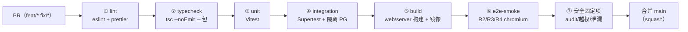

# CI/CD 方案 —— 票夹通（TicketWallet）

> 文档版本：v1.0 ｜ 撰写日期：2026-09-14 ｜ 撰写角色：ops（运维负责人） ｜ 状态：待评审
> 上游依据：`03_engineering/engineering-plan.md` §3/§4/§5（分支策略、测试门禁、CI/CD）、`03_engineering/tech-stack.md` §7（测试工具）、`03_engineering/repo-layout.md` §2（测试目录）
> 下游读者：开发实施会话（流水线配置落地）、qa（门禁阈值对齐）、support（发布窗口口径）

---

## 1. 背景

票夹通由多个开发会话接力实施、单机部署、trunk-based 分支（engineering-plan §3）。CI/CD 的目标不是「炫技式全自动化」，而是三件朴素的事：**合入 main 前把住质量与安全门禁、从 tag 到生产一键可重复、发布出问题 5 分钟内自动退回**。对应 pm 设定的质量指标——核心接口 P95 <500ms、可用性 ≥99.5%——本方案在流水线中以夜间性能基线与发布健康门禁承接。

选型：GitHub Actions（或等价 CI）三 job 并行 + SSH 单机部署。不为单机制度引入 K8s/GitOps/Argo 等复杂度（tech-stack T1）。

## 2. CI 流水线阶段

### 2.1 PR 触发（合并前置，全绿才可合入 main）

各阶段要点：

| # | 阶段 | 内容 | 并行策略 |
| --- | --- | --- | --- |
| ① | lint | eslint + prettier --check，0 error 0 warning 门禁 | web / server / shared 三 job 并行，缓存 pnpm store |
| ② | typecheck | `tsc --noEmit` 三包各自执行，契约漂移在此拦截（T2） | 同上 |
| ③ | unit | Vitest：shared schema、口径 A3、脱敏/金额工具、CSV 转义、剩余天数 | 同上 |
| ④ | integration | Supertest 起 NestJS 测试实例 + PG service 容器（每用例 truncate）；覆盖 api-design §4 全接口与错误码断言 | server job 内串行（共享测试库） |
| ⑤ | build | `pnpm build`（web 产物 + server 产物）+ Docker 镜像构建（不推送，仅验证 Dockerfile 可用） | 三 job 汇聚后执行 |
| ⑥ | e2e-smoke | Playwright chromium：R2 登录 / R3 录入 / R4 筛选（含越权 404 断言） | build 后执行 |
| ⑦ | 安全固定项 | 见 §4.2 | 与 ⑥ 并行 |

### 2.2 夜间触发（main，每晚 02:30 东八区）

1. **全量 E2E**：R1–R10 全部 spec，chromium + webkit、375px 与 1280px 双视口（engineering-plan §4.2 映射表）；
2. **性能基线**：k6 脚本，1000 条种子数据组合筛选，阈值 P95 <500ms；**连续两次超标才告警**（防抖动误报），告警走 monitoring.md §5 的 P1 通道；
3. **swagger 一致性 diff**：NestJS 生成的 OpenAPI 与 api-design.md 契约 diff，漂移即红灯（api-design §8.2 行动 1）。

### 2.3 tag 触发（CD，见 §5）

## 3. 质量门禁

### 3.1 阈值总表（任一不满足即阻塞合并）

| 门禁 | 阈值 | 检测位置 |
| --- | --- | --- |
| lint | 0 error / 0 warning | CI ① |
| typecheck | 0 error | CI ② |
| 单测行覆盖 | ≥80%（shared 包与业务 service） | CI ③，coverage 报告留档 |
| 集成用例 | api-design §6 **每个错误码至少 1 个用例**；P0 接口（auth/invoices）全覆盖 | CI ④ |
| E2E smoke | R2/R3/R4 全绿 | CI ⑥ |
| 安全固定项 | §4.2 四项全绿 | CI ⑦ |
| PR 规范 | 关联 features.md 至少一条验收编号（描述含 Given/When/Then） | 人工评审 + 模板校验 |
| 分支生命周期 | feat/fix 分支 ≤3 天，超期机器人提醒归并 | 仓库规则 |

### 3.2 门禁豁免纪律

- **不设 skip 标志旁路**：任何阶段红灯必须修复或回退代码，不允许 merge admin 绕过；
- 唯一例外：`pnpm audit` 高危 CVE 刚披露、上游尚无修复版本时，可开 issue 记录并 pin 版本（48h 复查，engineering-plan §6.3 依赖风险条款），豁免须在 PR 描述引用 issue 号。

### 3.3 安全测试固定项（每次 PR 必跑，任一红即阻塞）

1. **ownership 越权矩阵**：4 类资源（发票详情/编辑/删除/附件）× 2 用户交叉访问，全部断言 `404 INV_001`（F07 验收第 4 条，`apps/server/test/ownership.spec.ts`）；
2. **会话过期**：过期 session 访问业务接口断言 `401 AUTH_003`；
3. **上传魔数绕过尝试**：`.zip` 改后缀 `.pdf`、伪造扩展名文件，断言 `422 ATT_003`；
4. **密钥泄漏扫描**：`.gitignore` 白名单校验（`.env` 不入库）+ 提交内容 grep 密钥特征（`DATABASE_URL`、session 盐模式）。

## 4. 制品与版本

1. 镜像命名 `tw-api:v{tag}` / `tw-web:v{tag}`，tag 即 git tag（`v{里程碑}.{序号}`，如 v1.0.0=M1 首个验收版），**禁止 latest 部署生产**；
2. 镜像推送到 GHCR（免费档）；生产保留**最近 3 个 tag**，更早的由定期任务清理；
3. 制品与迁移绑定：镜像内不含迁移状态，`prisma migrate deploy` 在部署时执行（deployment.md §4 步骤 6），迁移文件随代码同 tag。

## 5. 发布策略（CD）

### 5.1 策略选择：单机「健康门禁式滚动发布 + 自动回退」

单机无负载均衡，**不具备真蓝绿/金丝雀双活条件**（违反 T1 不扩容的前提下），采用最接近的组合：

| 策略要素 | 本项目做法 |
| --- | --- |
| 发布单位 | git tag → 镜像 tag，一键可重复 |
| 停机窗口 | api 容器重建 <10 秒（PG 与数据卷不动，用户仅感知一次请求重试）；发布窗口固定 **每周四 21:00–22:00（东八区）**，避开记账高峰 |
| 滚动 | compose 只重建 api/caddy，postgres 容器不动（deployment.md §5.1） |
| 灰度 | M3 W6 试运行 7 天 = 真实用户灰度（真实数据录入 + 性能观测，engineering-plan §2.2）；正式运行后无多实例灰度条件，靠 staging 预演替代 |
| 回退 | 部署后拨测 30 秒内不通 → **自动回退上一 tag**（§5.2 步骤 6） |

### 5.2 CD 流水线步骤（tag push 触发）

1. CI 全量复跑（同 §2.1 七阶段，作为发布前最后一道）；
2. 构建并推送 `tw-api:v{tag}` / `tw-web:v{tag}`；
3. SSH 到生产机，**部署前自动 `pg_dump`** 落 `/data/backups/pre-deploy-{tag}.dump`（先备份后迁移，engineering-plan §6.2）；
4. `docker compose pull` → `prisma migrate deploy`（失败即中止并按 deployment.md §5.2 回退）；
5. `docker compose up -d`（重建 api/caddy）；
6. **健康门禁**：每 5 秒拨测 `GET /api/v1/health` 共 6 次（30 秒窗口），任一非 200 → 自动改回上一 tag 镜像 `up -d` 并再验证 → 通知失败告警；
7. 发布通知：推送结果（tag、耗时、迁移版本、健康检查结论）到值班频道，写入发布日志。

### 5.3 发布纪律

1. 生产发布只允许从 `release/{tag}`（M3 起）或 main 的 tag 触发，禁止从 feat 分支直达生产；
2. 数据库迁移必须**先经 staging 全量验证**（含 migrate up/down 可逆性检查）方可上生产；
3. 紧急修复（hotfix）：从 main 拉 `fix/{issue}` → 走完整门禁 → 新 tag 发布，**不允许跳过门禁的「紧急直推」**；
4. 每次发布后 30 分钟内人工冒烟（登录/录入/列表/导出四链路），结果回填发布日志。

## 6. 验收标准与后续行动

### 6.1 验收标准

- [x] PR / 夜间 / tag 三类触发器的阶段、顺序、并行关系完整（§2）
- [x] 质量门禁有可量化阈值与豁免纪律，安全固定项四条与 engineering-plan §4.3 对齐（§3、§4.2）
- [x] 发布策略适配单机现实（滚动重建 + 30 秒健康门禁自动回退 + 试运行灰度），发布 7 步可执行（§5）
- [x] 应用回滚 RTO ≤5 分钟（自动回退 30 秒判定 + 人工兜底 5 分钟内）

### 6.2 后续行动

1. M1 开工会话落地 `.github/workflows/ci.yml`（PR）与 `nightly.yml`（夜间），job 拆分按 §2.1 表；
2. M3 W4 前完成 `deploy.yml`（tag CD）并在 staging 全流程演练两次（含一次故意失败的自动回退验证）；
3. 性能基线脚本（k6 + 1000 条种子）由 qa 在 M1 W2 交付后接入夜间任务。
