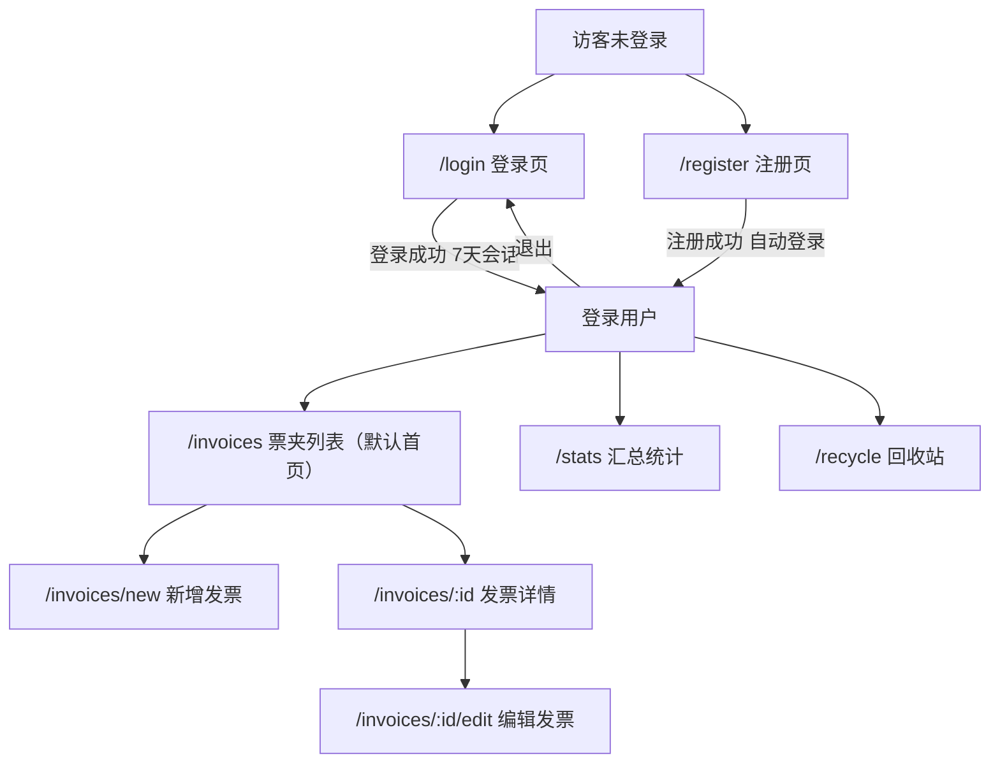
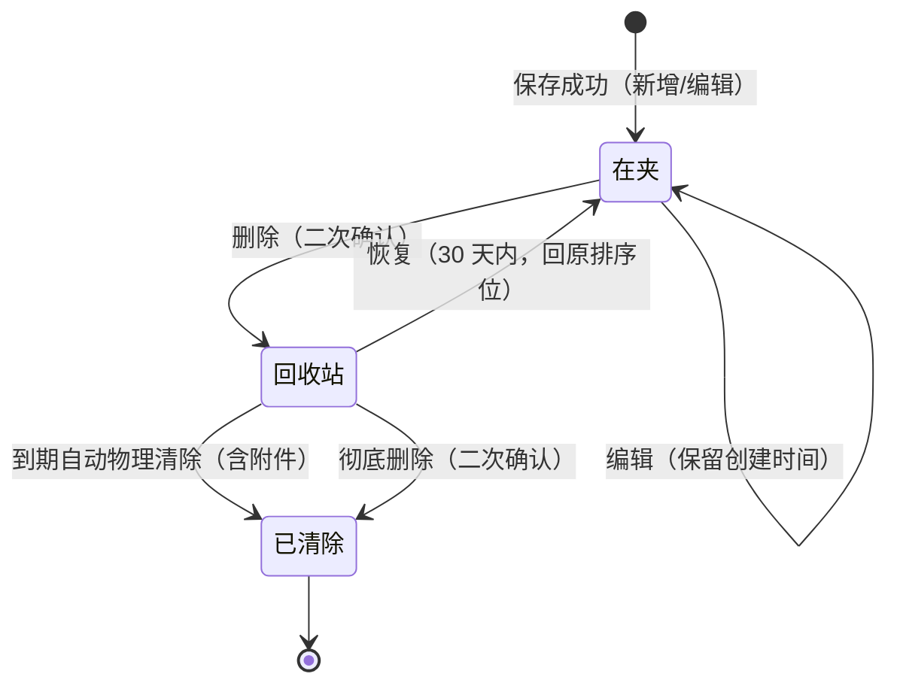

> 来源: P20260914-1728-网页版票夹管理发票/02_design/information-architecture.md | 角色: designer

# 信息架构 —— 票夹通（TicketWallet）

> 文档版本：v1.0 ｜ 撰写日期：2026-09-14 ｜ 撰写角色：designer（UI/UX 设计师） ｜ 状态：待评审
> 上游依据：`01_product/PRD.md` §6（范围）、`01_product/features.md` §2–§3（F01–F15）、`01_product/user-stories.md` §3（J1–J4）
> 下游读者：tech（路由设计）、support（导航口径话术）。

---

## 1. 背景

票夹通的 MVP 功能面收敛在「账号 + 台账 + 检索 + 汇总 + 导出 + 回收站」，一级任务不超过 3 个，用户是财务语境下的 P1/P2 用户（见 PRD §2）。信息架构的目标：**让「录入 → 翻查 → 汇总导出」的主链路在结构上无分叉**，同时把安全概念（脱敏、回收站、退出）放进用户一眼可及的位置。

本文档定义站点地图、导航结构、核心概念模型与术语表，是 `pages.md`（页面清单）与 `wireframes.md`（线框图）的结构基础。

## 2. 站点地图

### 2.1 结构图



### 2.2 路由表

| 路由 | 页面 | 里程碑 | 承载功能 | 未登录访问行为 |
| --- | --- | --- | --- | --- |
| `/login` | 登录页 | M1 | F02 | 放行 |
| `/register` | 注册页 | M1 | F01 | 放行 |
| `/invoices` | 票夹列表（登录后默认首页） | M1 | F07/F08/F13/F14 | 302 → `/login`，登录后回跳 |
| `/invoices/new` | 新增发票 | M1 | F04/F11/F15 | 302 → `/login` |
| `/invoices/:id` | 发票详情 | M1 | F07/F11 | 302 → `/login`；他人/不存在 id → 「记录不存在」页（不暴露存在性） |
| `/invoices/:id/edit` | 编辑发票 | M2 | F05 | 同上 |
| `/stats` | 汇总统计 | M2 | F09/F10 | 302 → `/login` |
| `/recycle` | 回收站 | M2 | F06/F12 | 302 → `/login` |
| `*` | 404 页 | M1 | — | 展示 404 与返回首页按钮 |

补充规则：登录页/注册页在**已登录**状态下访问时直接跳转 `/invoices`，避免重复注册入口。

## 3. 导航结构

### 3.1 一级导航的取舍

一级入口仅 3 个：**票夹、汇总、回收站**。理由：功能映射清晰（票夹=记录、汇总=数字、回收站=兜底）；新增发票作为「动作」不占导航位，用常驻按钮承载（桌面顶栏主按钮 + 移动端 FAB）。不设侧边栏——3 个入口用侧边栏是空间浪费，顶栏/底部 Tab 即可（DP5 轻量克制）。

### 3.2 桌面端（≥1024px）：全局顶栏

```
[Logo 票夹通]  [票夹] [汇总] [回收站]        [＋新增发票(主按钮)]  [👁 显示号码]  [账号 138****1234 ▾]
```

- 左：Logo + 一级导航（当前项主色文字 + 底部 2px 指示条）。
- 右：新增发票（primary 主按钮）、脱敏切换（眼睛，F13）、账号菜单（点击展开：脱敏账号标识、退出按钮——退出一步可达，US03 AC2）。

### 3.3 移动端（<768px）：顶栏 + 底部 Tab + FAB

```
顶栏：[票夹通]                        [👁] [账号 ▾]
内容区：页面主体（含筛选、列表/卡片）
底部 Tab：[📄 票夹] [📊 汇总] [🗑 回收站]   （右下悬浮 [＋] FAB）
```

- 底部 Tab 三项固定，当前项主色 + 填充图标；FAB 56px 悬浮于右下（`radius-full`，`shadow-3`），代表最高频动作「新增发票」。
- 顶栏保留眼睛切换与账号菜单（含退出），保证安全控件在移动端一级可见。

### 3.4 页内导航

- 票夹列表页：筛选区吸顶常驻（条件不因翻页丢失，F08 验收）。
- 详情页：面包屑「票夹 / 发票详情」+ 返回按钮（移动端左上角返回箭头）。
- 表单页：保存成功后返回列表并定位到新记录位置；取消/返回时若有未保存内容弹确认（见 interactions.md R3）。

## 4. 核心概念模型

### 4.1 对象模型：一条「开票记录」（Invoice）

用户操作的最小单位不是「发票文件」而是「开票记录 = 结构化字段 + 附件组」：

```
开票记录 Invoice
├── 身份组：发票代码(选填) · 发票号码(必填 8–20 位)
├── 交易组：开票日期 · 抬头(购买方名称) · 金额 · 税额 · 价税合计(自动=金额+税额)
├── 分类组：票种(专票/普票) × 介质(电子/纸质) → 类型四象限
├── 状态组：正常 / 作废 / 红冲（单选，默认正常）
├── 备注组：备注(≤200 字)
└── 附件组：0–3 个文件(jpg/png/webp/pdf，单个 ≤10MB)
```

### 4.2 双维类型模型（PRD A1）

类型 = 票种 × 介质，界面统一呈现为四象限标签，检索时四个筛选项分别映射维度：

| 筛选项（用户所见） | 映射维度 | 结果 |
| --- | --- | --- |
| 电子 | 介质=电子 | 电子专票 + 电子普票 |
| 纸质 | 介质=纸质 | 纸质专票 + 纸质普票 |
| 专票 | 票种=专票 | 电子专票 + 纸质专票 |
| 普票 | 票种=普票 | 电子普票 + 纸质普票 |

记录上的类型标签显示组合值（如「电子普票」），让维度关系自解释；筛选器多选之间为 OR（同维度内）、不同维度间 AND。

### 4.3 状态模型与汇总口径联动（PRD A3）

| 状态 | 语义 | 对汇总的影响 | 列表/筛选 |
| --- | --- | --- | --- |
| 正常（默认） | 有效票据 | 计入有效张数与有效金额 | 可筛、可见 |
| 作废 | 开具后作废留痕 | 只计总张数，不计有效金额 | 可单独筛出（US08 留痕核对） |
| 红冲 | 冲红原票 | 按票面金额以负数冲减有效金额 | 可单独筛出 |

汇总页在数字旁提供口径图例（「有效金额 = 正常票金额 + 红冲票负数金额」），兑现 DP2「台账透明」。

### 4.4 生命周期状态机



关键不变式：回收站内记录**不可编辑、不参与列表/筛选/汇总/导出**（F12 规则）；「已清除」不可达恢复（文案在回收站中用「剩余 N 天」提前预警，≤7 天转警示色）。

### 4.5 空间隐喻（贯穿全站的三个空间）

1. **票夹（主空间）**：`/invoices` 列表 = 台账本体，一切检索、汇总、导出的数据源。
2. **回收站（暂存空间）**：票夹之外，30 天倒计时的缓冲区；进入即从主空间所有口径中消失。
3. **汇总（投影）**：`/stats` 是对票夹的只读聚合视图，不产生新数据，口径固定（东八区自然月/自然年）。

## 5. 术语表（UI 文案唯一用词，support 话术对齐）

| 概念 | UI 统一用词 | 禁用的同义词 | 说明 |
| --- | --- | --- | --- |
| Invoice record | 发票 / 记录 | 单据、票据（泛称可用「票」） | 列表页标题用「我的票夹」 |
| 购买方名称 | 抬头 | 客户名、购买方 | 表单 label 写「抬头（购买方名称）」 |
| 金额+税额 | 价税合计 | 总金额、合计金额 | 只读自动计算 |
| 移入回收站 | 删除（弹窗注明「移入回收站，30 天内可恢复」） | 移除、清除 | 「清除/彻底删除」仅用于回收站 |
| 状态-红冲 | 红冲 | 冲红、负数发票 | — |
| 状态-作废 | 作废 | 废票、无效票 | — |
| 汇总数字 | 有效金额 / 有效张数 | 净额、合计 | 口径见图例 |
| 账号 | 手机号 / 邮箱 | 用户名、ID | 注册后不可更换（MVP） |

## 6. 路由 × 权限矩阵

| 能力 | 访客 | 登录用户 | 备注 |
| --- | --- | --- | --- |
| 访问 /login、/register | ✅ | 自动跳 /invoices | — |
| 票夹列表/筛选/翻页 | ❌ 302 | ✅ | 越权：仅本人数据（tech 提供越权用例） |
| 新增/编辑 | ❌ | ✅（编辑 M2） | 回收站内记录无编辑入口 |
| 详情 | ❌ | ✅ 仅本人记录 | 他人 id 显示「记录不存在」（防存在性探测） |
| 汇总/导出 | ❌ | ✅ | 导出范围=当前筛选，≤5000 条 |
| 回收站/恢复/彻底删除 | ❌ | ✅ | 仅本人回收站 |
| 退出 | — | ✅ 一步可达 | 会话 7 天 |

## 7. 验收标准与后续行动

### 7.1 验收标准

- [x] 站点地图覆盖 F01–F12 全部页面入口，无孤立路由
- [x] 一级导航 3 项 + 新增动作按钮，桌面/移动双形态明确
- [x] 概念模型解释双维类型（A1）、状态口径（A3）、生命周期（30 天回收站）三套核心机制
- [x] 术语表统一 UI 用词，与 PRD/features 口径一致
- [x] 路由权限矩阵含未登录、越权、已登录重复访问登录页的行为定义

### 7.2 后续行动

1. tech 按 §2.2 路由表实现前端路由与鉴权拦截（302 回跳、404、记录不存在页）。
2. `pages.md` 依据本文档展开每页元素与状态；`wireframes.md` 依据 §3 导航结构绘制。
3. support 依据 §5 术语表统一客服话术（尤其「删除 vs 彻底删除」）。
4. 若 pm 后续将「忘记密码」纳入 M2（Q1），需在站点地图增补 `/forgot-password` 与对应流程，届时升版本号。
