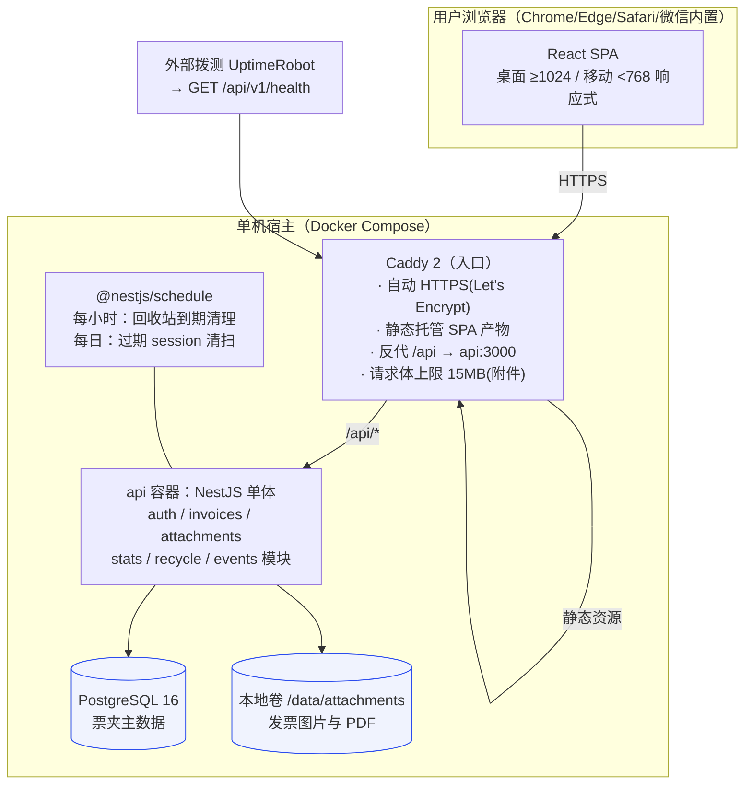
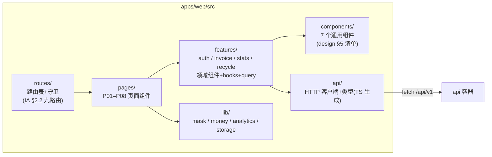
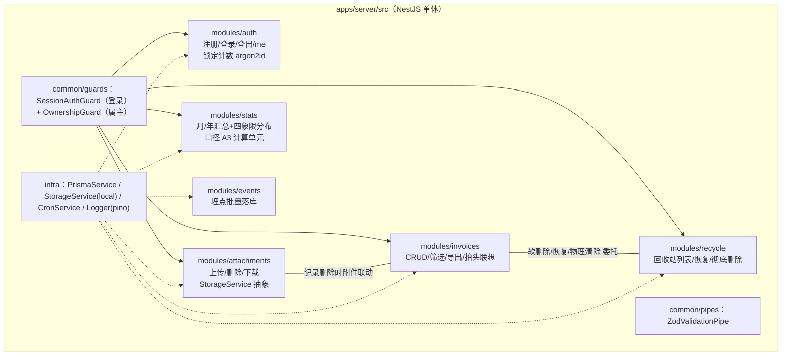
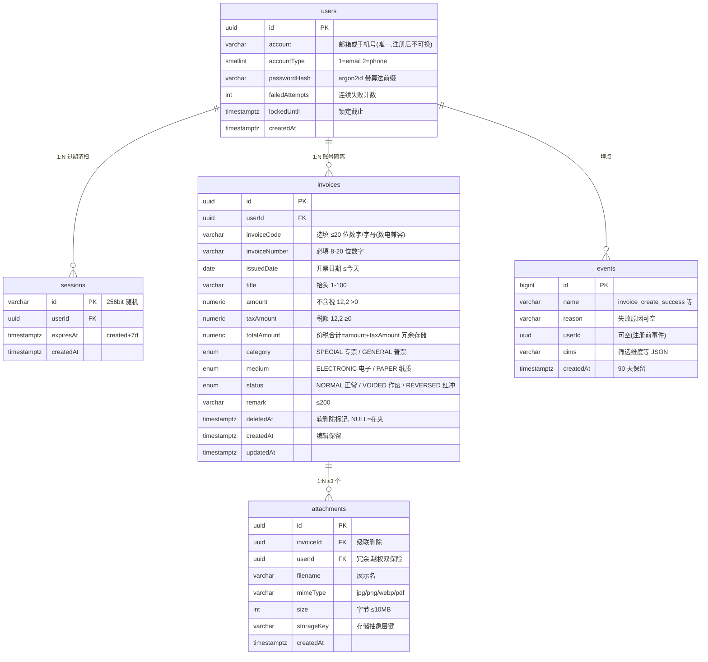
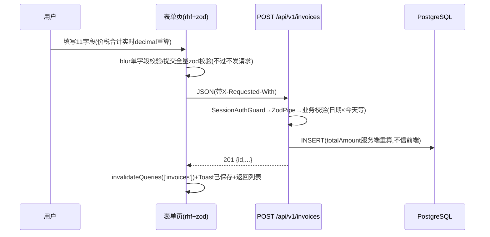
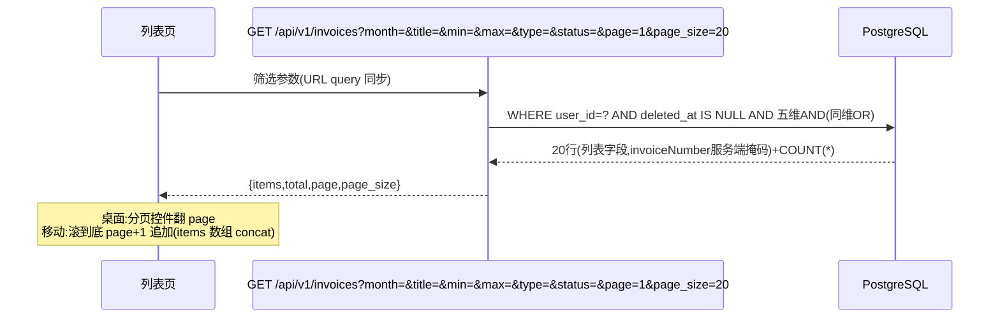
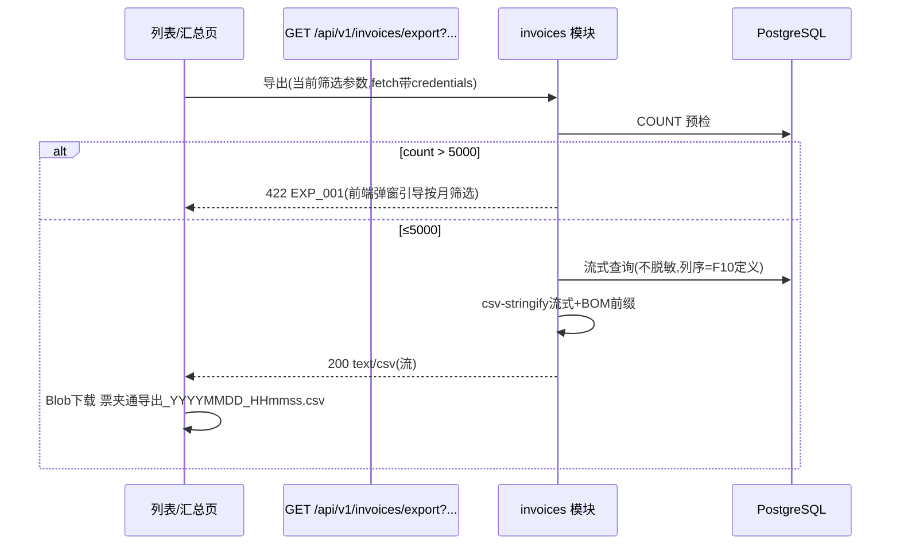

> 来源: P20260914-1728-网页版票夹管理发票/03_engineering/architecture.md | 角色: tech

# 系统架构 —— 票夹通（TicketWallet）

> 文档版本：v1.0 ｜ 撰写日期：2026-09-14 ｜ 撰写角色：tech（技术负责人） ｜ 状态：待评审
> 上游依据：`03_engineering/tech-stack.md` v1.0、`01_product/features.md` F01–F15、`02_design/information-architecture.md`（路由/概念模型/生命周期）、`02_design/interactions.md` R1–R10
> 下游读者：开发实施会话（按 §4 模块认领）、ops（部署拓扑见 §2）、qa（数据流与 E2E 映射）

---

## 1. 背景

票夹通的整体架构是**单机单体**：一个 React SPA + 一个 NestJS 单体服务 + 一个 PostgreSQL 实例 + 本地附件卷，由 Caddy 统一入口（HTTPS 自动签发、静态托管、`/api` 反代）。选型理由见 tech-stack.md；本文回答三件事：**模块怎么切、数据怎么存、请求怎么流**。

架构必须兑现的硬约束（源自章程与 PRD）：

| 约束 | 架构落点 |
| --- | --- |
| G2：1000 条内组合筛选 ≤1s | §5.3 索引设计 + 单跳查询（无缓存层） |
| G4：账号隔离 | §4.2 所有权守卫——所有业务表查询强制 `user_id` 谓词，对象级授权不靠前端 |
| G4：退出后会话立即失效 | §4.2 服务端 session 表，登出即删行 |
| 回收站 30 天自动清除（F12） | §6.5 定时任务 + 附件级联物理删除 |
| 越权返回「记录不存在」不暴露存在性（IA §6） | API 层 404 语义统一（见 api-design §6） |
| 桌面分页与移动「加载更多」同一 API（design 交接） | §6.2 分页协议 page/page_size 双形态复用 |

## 2. 系统上下文与部署拓扑



要点：

1. **唯一入口 Caddy**：全站 HTTPS 由 ACME 自动完成（G4 抓包验收的保障）；SPA 静态产物与 API 同源，**无跨域 Cookie 问题**；
2. **附件上传链路**中 Caddy `request_body max_size 15MB` 为第一道闸，NestJS multer（10MB）与魔数校验为第二、三道闸（纵深防御）；
3. 拨测仅探测健康端点，不触碰业务数据。

## 3. 前端架构

### 3.1 分层与目录映射



- **routes**：集中式路由表 + `RequireAuth` 守卫（未登录 `302 /login?redirect=`，已登录访问 /login|/register 自动跳 /invoices——IA §2.2 补充规则）；
- **features** 按业务域组织（与后端六模块一一对应），域内组件不跨域引用，跨域只走 components 与 lib；
- **lib** 承载三个横切工具：
  - `mask.ts`：脱敏矩阵（design-spec §6.2）的唯一实现——`maskInvoiceNo(****5678 保留末4位)`、`maskAccount(138****1234 / a***@x.com)`；列表页消费掩码态数据，**后端列表接口默认返回掩码值**（见 §4.2 安全注记），前端「眼睛切换」时再以完整号请求详情或携带 `show_sensitive=1` 重拉当前页；
  - `money.ts`：decimal.js 封装（两位小数、千分位、负数红冲展示 `-2,000.00`）；
  - `analytics.ts`：埋点字典类型化封装（30+ 事件），`sendBeacon` 批量上报，断网静默丢弃不重试（埋点不阻塞业务）。

### 3.2 前端状态边界

| 状态 | 归属 | 说明 |
| --- | --- | --- |
| 列表/详情/汇总/回收站数据 | TanStack Query（服务端状态） | 写操作成功后 `invalidateQueries(['invoices', 筛选签名])`——R4「写后以当前条件重拉」 |
| 脱敏偏好 `pref_show_sensitive` | localStorage + Context | design-spec §6.4，会话间记忆 |
| 表单草稿（断网不丢，R3） | react-hook-form 内存 + `sessionStorage` 暂存 | key 按 `draft:invoice:new` / `draft:invoice:{id}` |
| URL query 筛选/页码 | 路由 searchParams | `?month=2026-08&title=科技&page=2`（interactions R4），刷新/分享不丢上下文 |

## 4. 后端架构（模块划分）

### 4.1 模块图



### 4.2 各模块职责与关键规则

| 模块 | 职责 | 关键规则（对应验收） |
| --- | --- | --- |
| auth | 注册（F01）、登录（F02）、登出（F03）、GET me | 连续 5 次失败 `failed_attempts+1`，第 5 次写 `locked_until=now+10min`；锁定期间正确密码也拒绝（返回剩余分钟数）；登录成功清零计数；密码错误统一「账号或密码错误」不泄露字段 |
| invoices | 录入（F04）、编辑（F05）、列表筛选（F07/F08）、CSV 导出（F10）、抬头联想（F15） | 所有查询强制 `userId` + `deletedAt: null`；筛选五维（月/抬头 contains/金额区间/类型多选/状态多选）AND 组合，同维度 OR；导出前 `count` 预检 >5000 拒绝（EXP_001）；抬头 ILIKE + pg_trgm |
| attachments | 上传（F11）、删除、流式下载 | 扩展名+魔数双校验；≤10MB；每记录 ≤3 个（DB 计数前置校验）；下载走 OwnershipGuard，响应 `Content-Disposition: inline` 预览 |
| stats | 汇总卡（F09） | **口径 A3 单一实现点**：`有效金额 = SUM(CASE status WHEN 正常 THEN total WHEN 红冲 THEN -total END)`，作废不计金额只计张数；东八区自然月/年边界由服务器固定 +08:00 计算（F09 验收第 3 条） |
| recycle | 回收站列表/恢复/彻底删除（F06/F12） | 列表按 `deletedAt` 倒序 + 剩余天数=30-⌊(now-deletedAt)/1d⌋；恢复=置空 deletedAt（排序位天然回原位——列表按开票日期排序，无需记录原位置）；彻底删除=事务内删发票行+存储层删附件文件 |
| events | 埋点批量写入 | 批量 insert，匿名字段不落 PII，仅 90 天保留 cron 清理 |

**安全注记（G4 账号隔离的实现纪律）**：

1. **双层守卫**：SessionAuthGuard 解出 `req.user`；OwnershipGuard 对带 `:id` 的路由以 `prisma.invoice.findFirst({ where: { id, userId: req.user.id } })` 校验属主，**查不到一律 404**（不返回 403，防存在性探测——IA §6）；
2. **列表默认掩码**：`GET /invoices` 返回的 `invoiceNumber` 服务端直接掩码（`****5678`），完整号仅 `GET /invoices/:id`（详情页口径）与导出 CSV 返回——即便浏览器被抓包，列表响应也不含全号，比纯前端掩码强一个纵深层级，同时兼容 design-spec §6.2 矩阵；
3. session ID 为 256bit CSPRNG，Cookie `HttpOnly; Secure; SameSite=Lax; Path=/`，登出删除 DB 行并清 Cookie。

### 4.3 共享契约包（packages/shared）

内容：发票 zod schema（11 字段规则=features F04 表）、筛选参数 schema、错误码常量枚举、事件字典常量、类型导出。前端表单、后端管道、E2E 断言三端引用同一份规则，**校验规则变更只改一处**（T2）。

## 5. 数据模型

### 5.1 ER 图



要点：

1. **totalAmount 冗余存储**：金额区间筛选（A4）与汇总直接作用于该列，避免查询期相加；写入时以 decimal 严格计算保证 `= amount + taxAmount`；
2. **红冲语义**：红冲记录 `totalAmount` 存票面正数，**汇总时取负**（CASE WHEN status=REVERSED THEN -total），列表展示原票面值——与 IA §4.3 一致；
3. **软删除**：`deletedAt` 非空即回收站态；列表/筛选/汇总/导出一律带 `deletedAt IS NULL`（部分索引保证）。

### 5.2 存储选型补充

金额列 `numeric(12,2)`（上限 9,999,999,999.99 覆盖 PRD 上限 99,999,999.99 富余 100 倍）；枚举用 PG enum（非法值在 DB 层即拒绝，第二道校验）。

### 5.3 索引设计（G2 达成路径）

```sql
-- 列表/筛选主索引：账号内按开票日期倒序（覆盖排序 + deletedAt 过滤）
CREATE INDEX idx_inv_user_date ON invoices (user_id, issued_date DESC, created_at DESC)
  WHERE deleted_at IS NULL;
-- 抬头 contains 检索（ILIKE '%kw%'）
CREATE EXTENSION pg_trgm;
CREATE INDEX idx_inv_title_trgm ON invoices USING gin (title gin_trgm_ops)
  WHERE deleted_at IS NULL;
-- 金额区间筛选
CREATE INDEX idx_inv_total ON invoices (user_id, total_amount) WHERE deleted_at IS NULL;
-- 回收站倒序
CREATE INDEX idx_inv_recycle ON invoices (user_id, deleted_at DESC) WHERE deleted_at IS NOT NULL;
-- 附件计数前置校验
CREATE INDEX idx_att_invoice ON attachments (invoice_id);
```

**G2 论证**：单账号 1000 条 + user_id 前缀索引 → 过滤后集 <1000 行，五维 AND 在内存中评估，P95 查询耗时预估 <50ms（本地 PG 实测量级），叠加网络 RTT 与渲染远小于 1s 预算——**无需缓存层，索引即缓存**。若未来单账号达 10 万条，再评估（M3 前提下不触发）。

## 6. 关键数据流

### 6.1 录入保存（R3 正常流，G1）



### 6.2 列表筛选与分页（R4，双端同一 API）



### 6.3 CSV 导出（R6，G3）



### 6.4 附件上传（R7）

选择文件 → **前端即时三检**（扩展名/大小/已挂数量）不过不发请求 → `POST /invoices/:id/attachments`（multipart）→ multer 内存接收 → 魔数嗅探（JPEG `FFD8FF`/PNG `89504E47`/WEBP `RIFF....WEBP`/PDF `%PDF-`）→ `StorageService.put(storageKey)` 写卷 → DB INSERT。失败项前端标红重试，**记录与其他附件不受影响**（每次上传独立请求）。

### 6.5 回收站到期清理（每小时 cron，F12）

```mermaid
flowchart LR
    A[每小时: 扫描 deleted_at < now-30d] --> B{命中?}
    B -- 否 --> Z[结束]
    B -- 是 --> C[事务: 查附件storageKeys]
    C --> D[StorageService.delete 逐个删文件]
    D --> E[DELETE invoices 行(级联删 attachments 行)]
    E --> F[日志记录清除数量]
```

说明：先删 DB 行后删文件会产生孤儿文件（可被对账脚本清理）；**先删文件后删行**则中途失败会留「无文件附件行」——选择后者并让孤儿文件对账 cron 兜底（文件可重建性差、DB 行完整性优先）。

### 6.6 会话与 401 全局拦截（R9）

任意 API 返回 401 → 前端 HTTP 客户端拦截器统一处理：Toast「登录已过期」→ 1s 后跳 `/login?redirect=当前URL`；浏览器 offline 事件 → 顶部警示条常驻（`lib/connection.ts`）。

## 7. 横切关注点汇总

| 关注点 | 方案 | 落点 |
| --- | --- | --- |
| 鉴权 | session 表 + 双层守卫 | server common/guards |
| 校验 | shared zod schema 三端复用 | packages/shared |
| 脱敏 | 服务端列表掩码 + 前端 mask 工具 + localStorage 偏好 | server invoices / web lib/mask.ts |
| 错误 | 统一异常过滤器 → `{code,message,details}` | api-design §6 |
| 埋点 | 前端 sendBeacon → /events → 90 天保留 | web lib/analytics.ts |
| 日志 | pino JSON + requestId（进响应头 X-Request-Id） | server infra |
| 时区 | 业务口径固定东八区（汇总边界、日期≤今天） | server stats / invoices |

## 8. 验收标准与后续行动

### 8.1 验收标准

- [x] 部署拓扑、前后端模块、数据模型、六条关键数据流均有 mermaid 图与文字规则
- [x] G2（§5.3 索引论证）、G4（§4.2 双层守卫+列表掩码）、F12（§6.5 清理）、双端分页（§6.2）等硬约束逐条落位
- [x] 模块划分与 repo-layout.md 目录一一对应（§3.1/§4.1）
- [x] 口径 A3 收敛为 stats 模块单一实现点，避免多处计算漂移

### 8.2 后续行动

1. repo-layout.md 按本文模块图物化目录树（30 个目录内）；
2. api-design.md 将 §6 数据流落为具体接口契约与错误码；
3. M1 开工先落地 auth + invoices 两模块与共享包 schema，作为后续模块的参照实现。
