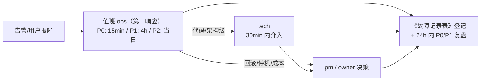

> 来源: P20260914-1728-网页版票夹管理发票/04_ops/runbook.md | 角色: ops

# 故障处置手册（Runbook）—— 票夹通（TicketWallet）

> 文档版本：v1.0 ｜ 撰写日期：2026-09-14 ｜ 撰写角色：ops（运维负责人） ｜ 状态：待评审
> 上游依据：`03_engineering/engineering-plan.md` §6.1/§6.2（降级与回滚口径）、`04_ops/monitoring.md`（告警分级与日志检索）、`04_ops/backup-dr.md` §4（恢复流程）、`03_engineering/api-design.md` §6（错误码=现象定位的第一线索）
> 下游读者：值班 ops（第一响应）、support（用户沟通口径）、tech（升级后的代码级修复）

---

## 1. 背景

本手册覆盖票夹通单机生产环境的**10 类常见故障**，每类按「现象 → 定位 → 处置 → 升级」四段式编写，值班人可在 15 分钟内（P0 响应时限）按步骤操作。三条总原则：

1. **先恢复，后根因**：P0 场景优先回滚/重启恢复可用，根因分析事后做；
2. **回滚决策口径**（engineering-plan §6.2）：P0（登录/录入/列表不可用）且 15 分钟内无法修复 → 立即回滚上一 tag；P1（附件/导出）→ 降级运行 + 当日修复；
3. **用户口径**：5xx 对外文案统一「服务开小差了/暂不可用」（api-design §6），support 不承诺具体恢复时间，以值班频道通报为准。

## 2. 通用排查入口（所有故障先看这三步）

1. **整体状态**：`curl -s -o /dev/null -w '%{http_code}' https://<域名>/api/v1/health`（200=服务+DB 正常；503=DB 层故障；超时/502=入口或进程故障）→ 对照 UptimeRobot 当前状态；
2. **容器状态**：`docker compose -p tw-prod ps`（三容器应 Up/healthy）+ `docker stats --no-stream`（内存/CPU 是否顶格）；
3. **近期日志**：`docker logs --since 30m tw-api 2>&1 | tail -100`；按用户报障反查：`grep '"reqId":"<用户提供的 X-Request-Id>"'`。

## 3. 故障卡片

### F01 全站不可访问（浏览器转圈 / 502 / DNS 不通）

- **现象**：UptimeRobot P0 告警（连续 2 次失败）；用户无法打开任何页面。
- **定位**：① `ping <域名>` / `dig +short <域名>` 确认 DNS 与 VPS 在线；② `curl -v https://<域名>` 看证书与握手；③ `docker compose ps` 看 caddy 是否退出；④ `docker logs --since 1h tw-caddy`。
- **处置**：① VPS 宕机/云控制台异常 → 走 backup-dr.md §4.1 整机重建（RTO 2h 预算）；② caddy 容器退出 → `docker compose up -d caddy` 重启并观察；③ 80/443 被防火墙/运营商拦截 → 云安全组核对（deployment.md §3.2）；④ VPS 存活但负载顶格 → 转 F08。
- **升级**：15 分钟未恢复 → 通报用户（状态页/群公告）+ 升级 tech 判断是否整机重建。

### F02 HTTPS 证书异常（浏览器告警「证书过期/不匹配」）

- **现象**：用户反馈红色告警页；巡检显示证书剩余有效期 <14 天（monitoring §3.3 第 5 项）。
- **定位**：① `echo | openssl s_client -connect <域名>:443 2>/dev/null | openssl x509 -noout -dates` 看到期日；② `docker logs tw-caddy | grep -i acme` 看 ACME 续期错误（常见：DNS 解析被改、80 端口不通、Let's Encrypt 限频）。
- **处置**：① DNS/端口问题 → 修复后 `docker compose restart caddy` 触发重签；② ACME 限频（一周 5 次同域名失败）→ 等待窗口或临时切 staging 环境 ACME 测试端点验证配置；③ 短期无法续期 → 通知用户暂用 `http://` 不可行（G4 强制 HTTPS），**宁可短停机也不裸 HTTP**。
- **升级**：24h 内无法重签 → tech + owner 决策（换 CA/换域名解析商）。

### F03 API 503 / SYS_002（数据库不可达）

- **现象**：health 返回 503；用户操作报「服务暂不可用」；表单草稿保留（engineering-plan §6.1 降级表）。
- **定位**：① `docker compose ps` 看 postgres 是否 unhealthy/重启循环；② `docker logs --since 15m tw-postgres`（OOM、磁盘满、损坏日志关键词）；③ `docker exec tw-postgres pg_isready`；④ `df -h`（PG 卷满是最常见根因）。
- **处置**：① 磁盘满 → 转 F04；② PG OOM 重启 → `docker compose up -d postgres`，恢复后 api 自愈（health 转绿）；③ 数据文件损坏 → backup-dr.md §4.2 恢复最近 dump；④ 连接数耗尽 → `SELECT count(*) FROM pg_stat_activity;` 杀空闲连接并排查泄漏（转 tech）。
- **升级**：需恢复 dump 时通知用户「数据回退至最近备份点」（RPO ≤24h 口径）；30 分钟未恢复 → owner 决策。

### F04 磁盘写满（上传失败 / PG 只读 / 告警 >95%）

- **现象**：P0 告警磁盘 >95%；附件上传报错；PG 报「could not extend file」。
- **定位**：① `df -h` 找满的分区；② `du -sh /data/attachments /data/backups /var/lib/docker/* | sort -h` 找大头（常见：备份暂存未清、docker 日志超限、附件增长）。
- **处置**：① 清 `/data/backups` 仅留最近 1 份（异机已有 14 份）；② `docker system prune -f` 清悬空镜像/构建缓存；③ 日志超限 → 核对 json-file max-size 配置（monitoring §3.2）并重启容器生效；④ 附件本体增长 → 属容量规划问题，扩磁盘（云盘在线扩容）+ 将磁盘告警阈值校准（monitoring §2.1）。
- **升级**：需扩容/迁机 → owner 成本决策（T5 约束内）。

### F05 附件上传失败（ATT_001/003 之外的写入错误）

- **现象**：上传报「稍后重试」；记录本体保存正常（降级设计，engineering-plan §6.1 第一行）；巡检附件失败率 >10%（P2）。
- **定位**：① `docker logs tw-api | grep -i 'storage\|ATT'` 看写入错误（权限 ENOENT/EACCES、磁盘满）；② `ls -ld /data/attachments` 核对属主与容器用户一致；③ 单用户复现（是否特定格式/大小）。
- **处置**：① 权限 → `chown -R` 对齐后重试；② 磁盘 → 转 F04；③ 特定文件魔数误判 → 收集样本交 tech（校验逻辑缺陷）；④ 无法短期修复 → 公告「附件功能暂不可用，台账不受影响」（降级运行，P1 口径）。
- **升级**：24h 未修复 → tech 出补丁随下一发布窗口上线。

### F06 大面积登录异常（全部 401 AUTH_003）

- **现象**：所有用户被登出且无法保持会话；R9 全局跳转登录页循环。
- **定位**：① `docker logs tw-api | grep session`（session 表是否被误清）；② 核对 `.env` session 盐是否变更（盐变=全量 Cookie 失效）；③ PG 中 `SELECT count(*) FROM sessions;`（异常归零=误操作/迁移破坏）。
- **处置**：① 盐被改 → 回滚 `.env` 值并重启 api；② session 表结构被迁移破坏 → backup-dr.md §4.2 恢复；③ 无法恢复 → 通知全体用户重新登录（session 丢失不损业务数据，影响可控）。
- **升级**：涉及数据恢复即通报 owner；根因涉及代码 → tech。

### F07 暴力破解 / 撞库（同 IP 高频登录失败）

- **现象**：巡检告警同 IP >50 次失败/10 分钟（P1）。
- **定位**：① `docker logs tw-api | grep AUTH_001 | awk '{print $ip}' | sort | uniq -c | sort -rn | head`；② 受害账号 `locked_until` 是否持续被锁。
- **处置**：① ufw/fail2ban 封禁该 IP（`fail2ban-client set sshd banip <ip>` 或防火墙规则）；② 确认 RATE_001 限流与账号锁定（5 次锁 10 分钟）生效——用户侧防线已在；③ 观察是否分布式来源 → 考虑 Caddy 层按 IP 限流加强（api-design §7 条款 5）。
- **升级**：疑似定向攻击特定账号 → 通知该用户改强密码；持续攻击 → owner 决策接入 WAF/CDN。

### F08 主机资源异常（CPU/内存持续顶格，服务卡慢）

- **现象**：P95 超标 P1 告警或页面明显卡顿；`docker stats` 显示 api 或 PG 长期 >85%。
- **定位**：① `top -c`/`docker stats` 定位进程；② api 高 → `docker logs tw-api | grep slow` 看慢查询/大导出；③ PG 高 → `SELECT pid, query, query_start FROM pg_stat_activity ORDER BY query_start;`（常见：全表扫描的筛选、超大 CSV 导出）。
- **处置**：① 终止异常查询 `SELECT pg_terminate_backend(<pid>);`；② 大导出导致 → 等 完成 + 提醒用户按月分批（EXP_001 预检外的正常重负载）；③ 内存逼近限额 → 核对 compose mem_limit（deployment.md §3.3）并适度上调（2GB 机器上限内）；④ 持续不降 → 重启 api 容器（<10s 影响）。
- **升级**：性能问题复发 → tech 优化索引/查询（architecture §5.3 是优化基线）。

### F09 回收站清理 / 定时任务未执行（F12 兑现风险）

- **现象**：巡检发现 24h 无 cron 执行记录（P2）；回收站条目 `daysLeft` 出现负数。
- **定位**：① `docker logs tw-api --since 48h | grep -i 'cron\|purge'`；② 容器是否发生过重启（schedule 不补跑错过的窗口）；③ 手动触发一次清理看是否报错。
- **处置**：① 任务报错（如附件删除失败）→ 按日志修文件系统问题后重跑；② 单纯漏跑 → 手动触发清理（运维命令），观察恢复正常；③ 连续漏跑 → 检查 api 容器健康与 schedule 注册。
- **升级**：清理逻辑缺陷 → tech 修 `purge.service.ts`；期间回收站条目暂留不清除，无数据风险。

### F10 发布后故障（CD 健康门禁失败 / 自动回退也失败 / 回归）

- **现象**：CD 步骤 6 拨测 30 秒不通自动回退（cicd.md §5.2）——常态自动闭环；本卡处置「自动回退失败」或「回退后仍有用户异常」。
- **定位**：① `docker compose ps` + `docker logs --since 10m tw-api`（新 tag 起不来的报错：迁移不匹配、env 缺失）；② 确认当前运行 tag：`docker inspect tw-api | grep Image`；③ 对照发布日志（pre-deploy dump 文件名）。
- **处置**：① 容器起不来 → 固定回上一稳定 tag（deployment.md §5.1 三步，5 分钟内）；② 迁移已半执行 → deployment.md §5.2 数据回滚（先 `prisma migrate resolve --rolled-back` 再恢复 pre-deploy dump）；③ 回退完成 → health + 四链路冒烟 + 通报。
- **升级**：P0 且 15 分钟未恢复 → owner 决策停机窗口；根因分析 24h 内出（为何 staging 未拦住）。

## 4. 升级路径与联系矩阵

1. **单人值班现实**：ops 不在位时由 support 承接入口并立即电话升级 ops；P0 场景允许「先执行 F01/F10 的回滚步骤再补登记」；
2. 每次故障处置后填《故障记录表》（时间线/级别/根因/处置动作/恢复耗时/用户影响），与 monitoring.md §5.3 月度回顾闭环；
3. 手册每季度随恢复演练（backup-dr.md §5）校订一次：验证步骤仍然成立、命令仍然可用。

## 5. 验收标准与后续行动

### 5.1 验收标准

- [x] 覆盖入口层（F01/F02）、数据层（F03/F04）、业务层（F05–F09）、发布层（F10）共 10 类故障，四段式（现象/定位/处置/升级）齐全
- [x] 与前序口径一致：回滚决策（engineering-plan §6.2）、降级表（§6.1）、错误码（api-design §6）、恢复流程（backup-dr.md §4）、告警级别（monitoring.md §5）
- [x] 通用排查入口三步可在 5 分钟内完成初步分诊（§2）
- [x] 升级路径 mermaid 图 + 单人值班兜底规则明确（§4）

### 5.2 后续行动

1. M3 W5 上线时将本文命令中的 `<域名>`、compose project name 等占位符替换为生产实值，并打印一份速查卡；
2. 试运行期（M3 W6）每触发一次真实告警，回填对应卡片的实际有效性（步骤是否能走通）；
3. 季度演练时同步校订本手册（§4 第 3 条），版本号随之上浮。
