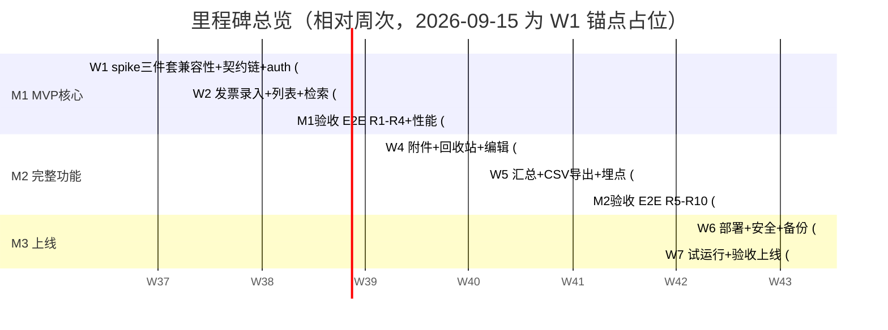

> 来源: P20260914-1728-网页版票夹管理发票/03_engineering/engineering-plan.md | 角色: tech

# 工程计划 —— 票夹通（TicketWallet）

> 文档版本：v2.0 ｜ 撰写日期：2026-09-14 ｜ 撰写角色：tech（技术负责人） ｜ 状态：待评审
> **v2.0：技术栈变更重跑（2026-09-15，用户决策 D6）**——后端由 NestJS 换 Spring Boot 4.1.1 + MyBatis-Flex 1.11.8 + JDK 25（Maven 构建）。里程碑框架（M1 核心 → M2 完整 → M3 上线）、分支策略、E2E 映射、降级/回滚/容灾三层兜底语义继承 v1.0；本版重排任务分解（新增 **W1 首日兼容性 spike 与契约链搭建**）、重写测试策略的 Java 侧与 CI 防线、补充 JVM/镜像兜底。
> 上游依据：`00_charter/charter.md`（M1–M3）、`01_product/features.md` §2、`02_design/interactions.md` R1–R10、`03_engineering/` v2.0 其余四份文档
> 下游读者：开发实施会话（按里程碑领取）、qa（测试策略）、ops（部署与容灾）、support（回滚期间的口径）

---

## 1. 背景

票夹通的开发节奏是「多会话接力 + 里程碑验收」：M0（本流程）产出文档与脚手架后，M1/M2/M3 由后续开发会话按模块认领实施。工程计划的核心目标：**每个里程碑有明确的完成定义（DoD）、每段工时有可验证的交付物、出问题时有兜底与回滚路径**。排期以「工作日相对周次」表达（W1 = M1 启动后第 1 周，下文 gantt 以 2026-09-15 为 W1 周一锚点占位，实际开工日整体平移，不绑定具体日历日）。

v2.0 的两点排期变化必须先说清楚：

1. **风险前置**：Spring Boot 4.1.1 × JDK 25 × MyBatis-Flex 1.11.8 三者组合未经生产验证（tech-stack 风险 R1），**W1 首日为强制 spike**，五项冒烟（起服务/连 PG/事务/分页/session 落库）48 小时内出结论，结论决定走主线还是 JDK 21 回退位——绝不带不确定性进入业务开发周；
2. **契约链先于业务**：OpenAPI 单一契约源是本轮多会话接力的命脉（取代 v1.0 的 shared 包），「springdoc 导出 → contracts 入库 → orval 生成 → CI 三道防线」在 W1 内全链打通，之后每个业务接口都生而受护栏保护。

## 2. 里程碑排期

### 2.1 总览



### 2.2 里程碑任务分解与 DoD

| 里程碑 | 周次 | 任务 | 完成定义（DoD，可勾验） |
| --- | --- | --- | --- |
| **M0（已完成）** | — | v2.0 五份工程文档 + scaffold/ 重物化（30 目录） | 本套文档 v2.0 + Java/pnpm 四区目录树落位 |
| **M1 MVP 核心** | W1 | ① **D1 首日 spike**：Boot 4.1.1 + JDK 25 + Flex 1.11.8 五项冒烟（起服务/连 PG/事务/分页/session 落库）+ ILIKE/enum TypeHandler 两个 PG 方言用例，结论回填 tech-stack §3 待核实项；② server 骨架：pom + 启动类 + common 全子包（安全/错误/日志/存储/Jackson 模块）；③ Flyway V1（users/invoices/attachments/events + SPRING_SESSION + pg_trgm + 全索引）；④ **契约链全通**：springdoc 导出 contracts/openapi.json 首版 → orval 生成 web/src/api/generated 首版 → CI 三道防线挂上；⑤ `domain/auth` 4 接口 + 登录锁定；⑥ web 骨架：路由表 + RequireAuth + 7 通用组件 + tokens.css；⑦ 登录/注册页（R1/R2 全异常路径） | spike 报告落档（五项全绿或回退决策）；注册→登录→登出 E2E 绿；锁定 10 分钟集成测试绿；AUTH_001~005 断言齐全；CI 上「改 Controller 注解不同步契约必红」演练一次通过 |
| | W2 | ① `domain/invoices`：POST/GET 列表五维筛选/GET 详情（QueryWrapper + 属主谓词 + 掩码出口）；② 录入表单（11 字段、blur+提交双校验、价税合计 decimal.js 实时、断网草稿）；③ 列表页（URL query 同步、脱敏眼睛切换 show_sensitive、空态两型、移动卡片/桌面表格）；④ 越权矩阵与 G2 性能用例 | **R3/R4 E2E 绿**；1000 条种子数据组合筛选 P95 <500ms（k6 实测）；OwnershipMatrixTest（4 资源 × 2 用户）全绿——用户 A 查不到 B 数据；G1 可用性走查 ≤2min |
| | W3（前半） | M1 验收冻结：E2E R1–R4 全绿 + 性能报告 + 安全基线走查（HTTPS 抓包、默认掩码、会话登出即失效） | M1 出口验收（§2.3）记录归档 |
| **M2 完整功能** | W4 | ① `domain/attachments` + StorageService 本地实现（三校验 + 进度 + 单项重试）；② `domain/recycle`（软删/恢复/彻底删/每小时清理 @Scheduled + 孤儿对账）；③ 编辑页（F05）；④ `domain/events` 埋点 | R5/R7 E2E 绿；30 天到期清理单测（时钟注入）绿；附件恢复联动用例绿 |
| | W5 | ① `domain/stats`（口径 A3 单点）+ 汇总页 + 四象限条形；② CSV 导出（count 预检/StreamingResponseBody/BOM/文件名）；③ F14 空态引导、F15 抬头联想（Could，工期富余才做）；④ 埋点全量接入 | **R6/R8/R10 E2E 绿**；口径用例（正常 8 + 红冲 1 + 作废 1 = 10 张/38,000 元）断言绿；Excel 打开 CSV 不乱码人工核验；M2 末验收冻结（R5–R10 全绿） |
| **M3 上线** | W6 | ① deploy/ 全量启用（Compose 三容器 + Caddy TLS + 域名 + /v3/api-docs 公网屏蔽）；② 备份 cron（pg_dump + 附件 rsync 异机）；③ 健康检查 + 拨测 + 告警通道；④ **镜像与内存预算核验**（api 镜像 <350MB、容器 768MB limit 下 RSS ≤550MB，tech-stack §6.2）；⑤ 安全清单（依赖 CVE 扫描、默认掩码走查、.env 不入库） | 生产 URL 全功能冒烟绿；备份恢复演练一次成功；内存/体积预算实测达标（或走 §6.2 逐级压缩） |
| | W7 | ① 7 天试运行（真实数据录入 + 性能观测）；② 修复试运行问题；③ 验收会（章程 G1–G5 逐条）与上线签发 | G1–G5 验收记录归档；遗留项进 issue 池 |

**并行与依赖**：契约链（W1 ④）是前后端并行的前提，必须先于 `domain/invoices`；此后前后端双线并行（接口契约即 contracts/ 工件）；M2 的 attachments 与 stats 无相互依赖可并行；deploy 编排 W2 起用开发环境预演（Compose dev profile），M3 只做生产切换。

### 2.3 里程碑出口验收（与章程对齐，继承 v1.0）

- M1：G1（录入 ≤2min 走查）、G2（1000 条筛选 ≤1s 实测）、G4 基线（隔离/HTTPS/掩码）；
- M2：G3（汇总口径断言 + CSV 不乱码）+ features.md §3 全部 Must/Should 逐条勾验；
- M3：G5 收口（可部署产物 + 运行手册 + ¥50/月成本实测）。

## 3. Git 分支策略（继承 v1.0）

**主干开发（trunk-based）+ 短命特性分支**：

| 分支 | 用途 | 规则 |
| --- | --- | --- |
| `main` | 唯一长期分支，随时可部署 | 禁止直推，仅 PR 合入；CI 全绿（含契约三道防线）是合并前置；tag `v{里程碑}.{序号}`（v2.0.0 = M1 首个验收版） |
| `feat/{module}-{topic}` | 功能分支 | 生命周期 ≤3 天，如 `feat/auth-lockout`、`feat/invoices-filter`、`feat/web-invoice-form`、`feat/contract-chain`；squash merge 回 main |
| `fix/{issue}` | 缺陷分支 | 关联 issue 号 |
| `release/{tag}`（M3 起） | 上线隔离 | 从 main 拉，只 cherry-pick 修复；上线后回合 main |

约定：Conventional Commits（`feat(invoices): 五维筛选 OR/AND 组装`）；**每个 PR 对应 features.md 至少一条验收编号**（描述列 Given/When/Then）；**涉及接口变更的 PR 必须包含 contracts/openapi.json 与 web/src/api/generated/ 的同步更新**（否则 CI 防线一/二直接红，无需人工把关）。不采用 Git Flow——单人接力 + 周级里程碑下双长分支是无谓开销（继承）。

## 4. 测试策略

### 4.1 分层与目标

| 层 | 工具 | 范围 | 目标 |
| --- | --- | --- | --- |
| Java 单测 | JUnit 5 + AssertJ | 口径 A3 计算（SummaryService）、掩码、金额序列化（BigDecimal→"4000.00"）、CSV 转义边界、锁定计数、daysLeft、魔数嗅探 | 行覆盖 ≥80%（common/ 与各 domain service） |
| Java 集成 | @SpringBootTest + MockMvc + **Testcontainers（PG16 真库）** | api-design §4 全 22 端点 + 16 错误码逐码断言 + **越权矩阵** | 每码 ≥1 用例；P0 接口（auth/invoices）全覆盖；Testcontainers 保证 pg_trgm/部分索引/enum 与生产同构（不用 H2 模拟） |
| 前端单测 | Vitest | mask/money 工具、筛选参数序列化、手写 zod schema 规则（8–20 位号码、金额两位小数等） | 工具函数全覆盖 |
| E2E | Playwright（chromium/webkit，375px + 1280px 双视口） | R1–R10 全流程含异常分支（映射表 §4.2，继承 v1.0） | R1–R10 每条 ≥1 绿 |
| 性能 | k6 + 1000 条种子数据 | 组合筛选、导出 5000 条流式 | P95 <500ms 进 M1 验收；导出内存峰值观测 |
| 静态 | checkstyle（轻量）/ eslint + tsc --noEmit | 风格与类型门禁；tsc 覆盖 generated 类型对手写代码的约束 | CI 必过 |

### 4.2 E2E 用例映射（R1–R10 → spec 文件，继承 v1.0）

| 流程 | spec | 必含异常断言 |
| --- | --- | --- |
| R1 注册 | `r1-register.spec.ts` | 密码不合规不发请求（网络 stub 断言 0 请求）、重复注册警示条、断网表单保留 |
| R2 登录 | `r2-login.spec.ts` | 密码错误统一文案、第 6 次锁定禁用按钮+剩余分钟、302 回跳 `?redirect=` |
| R3 录入/编辑 | `r3-invoice-form.spec.ts` | 校验矩阵逐字段、断网草稿重试回填、未保存离开确认弹窗、价税合计实时 |
| R4 筛选 | `r4-filter.spec.ts` | min>max 前置拦截、无结果空态、翻页条件保持（URL query 断言）、查询失败重试不丢条件 |
| R5 回收站 | `r5-recycle.spec.ts` | 两级删除确认文案不同、恢复回原位、剩余 ≤7 天警示色 |
| R6 导出 | `r6-export.spec.ts` | >5000 预检弹窗不下载、文件名格式、BOM 首字节、26 行计数 |
| R7 附件 | `r7-attachments.spec.ts` | 15MB 拒、第 4 个置灰、.zip 拒、单项失败重试且其他不受影响 |
| R8 脱敏 | `r8-masking.spec.ts` | 默认 `****5678`、切换记忆（localStorage `pref_show_sensitive`）、顶栏账号掩码 |
| R9 会话 | `r9-session.spec.ts` | 401 全局跳转、登出后后退无数据、offline 警示条 |
| R10 汇总 | `r10-stats.spec.ts` | 口径数字断言（38,000 案例）、负数红色、空数据 0 值 |

### 4.3 安全测试固定项（CI 必过，任一红即阻塞合并，继承 + v2.0 扩充）

1. **越权矩阵**：4 类资源（invoice 详情/编辑/删除、attachment 下载/删除、recycle 恢复/彻底删、export）× 2 用户交叉访问，全部断言 `404 INV_001` 且响应体无他人数据痕迹；
2. **会话失效**：登出后原 Cookie 重放全部业务接口 → `401 AUTH_003`（Spring Session 删行语义验证）；
3. **上传绕过**：改后缀假图（.png 头实为 zip）、超限体积、第 4 个附件——三道闸逐层断言（Caddy 15MB / multipart 10MB / 魔数）；
4. **CSRF 双保险**：写接口无 `X-Requested-With` 头 → `403 AUTH_006`（v2.0 新增项）；
5. **5xx 信息泄露**：制造 DB 断连，断言响应 message 为固定文案且不含堆栈/SQL/异常类名。

### 4.4 质量门禁（CI 流水线，继承 + 契约防线）

```
server job:  mvnw checkstyle → unit → integration(Testcontainers) → openapi 导出 → diff contracts/openapi.json（防线一）
web job:     eslint → tsc --noEmit（含 generated 类型约束）→ vitest → orval 重新生成 → diff web/src/api/generated（防线二）→ 手写 schema 类型对齐（防线三）
e2e job:     PR 触发 smoke 子集（R2/R3/R4）；main 每晚全量 R1–R10
```

契约三道防线细节见 tech-stack §7.3。Testcontainers 需要 Docker 环境，CI runner 预装；本地开发同构（devcontainer 或 compose dev profile）。

## 5. CI/CD

- **CI**：GitHub Actions（或等价）按目录分 job（server/web/e2e 并行），缓存 Maven `.m2` 仓库与 pnpm store；
- **CD（M3 起）**：main 打 tag → 多阶段构建 server 镜像（maven 构建层 → temurin-25-jre-alpine + 分层 jar）→ 推镜像仓库 → SSH 单机 `docker compose pull && up -d` → 拨测 `/api/v1/health` 30s 不通自动回退上一镜像 tag（§6.2）；
- **开发环境**：`docker compose -f deploy/compose.yaml --profile dev`（本地 HTTP + 热重载卷 + PG + Testcontainers 复用）；前端 `pnpm dev` 直连本地 api（8080）。

## 6. 技术兜底方案

### 6.1 功能降级预案（继承 v1.0 语义）

| 场景 | 降级动作 | 用户感知 |
| --- | --- | --- |
| 附件上传故障（磁盘满/写入失败） | 记录本体保存不受影响，附件区提示「暂不可上传，稍后重试」；结构化台账是主链路（R7 已按单项失败设计） | 可先录票后补附件 |
| CSV 导出超时/失败 | 前端 Toast + 重试入口；不产生半截文件（服务端先 count 后流式，失败即断流） | 重试即可，无脏文件 |
| F15 抬头联想故障/降级 | 接口空返回，前端不渲染下拉，手输不受阻（Could 级可整体下线） | 无感 |
| 埋点上报失败 | sendBeacon 静默丢弃，不做重试队列 | 无感 |
| 数据库连接抖动 | 健康检查 503 → 拨测告警；API 返回 SYS_002 文案；HikariCP 连接超时兜底 | 明确提示稍后重试，表单草稿保留 |
| Q1 忘记密码未上线期间 | support 人工核验后走运维脚本重置（运行手册），API 预留 AUTH_006+ 序号（注意：AUTH_006 已被 CSRF 码占用，忘记密码从 AUTH_007 起） | 客服通道 |

### 6.2 回滚方案（继承 + Java 侧更新）

1. **应用回滚**：镜像按 git tag 构建，生产保留最近 3 个 tag；`docker compose` 指定回退 tag + `/health` 验证，目标 RTO ≤5 分钟；
2. **数据回滚**：Flyway「**先备份后迁移**」——每次部署前自动 `pg_dump`；迁移失败用 dump 恢复（Flyway 无 Prisma migrate resolve 等价物的场景下，以「恢复 dump + 修复迁移脚本 + 重放」为标准动作）；**生产禁用 `flyway.clean`**，schema_history 只增不删；
3. **JDK 回退位**：W1 spike 失败时的预置路径——`pom.xml` 的 `<java.version>` 降 21 重新构建（Boot 4 支持矩阵内【待核实】），镜像基座换 temurin-21-jre-alpine；应用代码不感知；
4. **配置回滚**：Caddyfile/.env/compose 变更纳入 git，回滚即 checkout 历史版本重新渲染；
5. **回滚决策口径**：P0（登录/录入/列表不可用）且 15 分钟内无法修复 → 立即回滚上一 tag；P1（附件/导出）→ 降级运行 + 当日修复。

### 6.3 容灾与数据安全（继承）

| 项 | 方案 |
| --- | --- |
| 备份 | 每日 02:00（东八区）`pg_dump` + 附件卷 rsync → 异机/对象存储，保留 14 份；**每季度恢复演练**（M3 首演） |
| 单机故障 | Compose 一键重建（deploy/ 即基础设施代码）；数据以最近备份恢复，RPO ≤24h、RTO ≤2h（个人工具可接受阈值，写入运维手册） |
| 附件防误删 | 回收站物理清除先删 DB 行后删文件（architecture §6.5），孤儿文件每日对账 cron 兜底；备份含附件卷 |
| 密钥管理 | `.env`（DB 口令等）不入库（.gitignore 校验进 CI）；泄露处置 = 轮换 DB 口令 + 全量 session 失效（清 SPRING_SESSION 表强制重登） |
| 依赖风险 | Java 侧 `mvn dependency-check`（OWASP 插件）+ 前端 `pnpm audit` 每周跑；CVE 高危 48h 内升级或 pin |
| 内存/体积超预算 | tech-stack §6.2 逐级压缩（堆 384MB → CDS【待核实】）；仍超限升 2C4G 需主 Agent 批准（突破 ¥50/月约束） |

## 7. 风险登记（Top 风险与应对，v2.0 更新）

| # | 风险 | 概率/影响 | 应对 |
| --- | --- | --- | --- |
| R1 | **Boot 4.1.1 × JDK 25 × Flex 三件套组合未经验证**（含 springdoc/Flex starter 对 Boot 4 自动装配适配） | 中/高 | W1 首日 spike 五项冒烟 48h 出结论；降级序列：JDK 21 重试 → Boot 版本回退升级主 Agent 决策（不得私定）；tech-stack §9 R1 |
| R2 | **MyBatis-Flex × PG 方言**（ILIKE/enum/分页） | 中/中 | spike 两个专项用例；降级：@Select 注解 SQL / varchar+CHECK（仅动迁移脚本） |
| R3 | **多会话契约漂移**（本轮最高频风险） | 高/中 | 契约链 W1 全通 + CI 三道防线（§4.4）+ 生成物禁手改纪律（repo-layout §5）+ PR 必含契约同步 |
| R4 | **镜像体积/启动内存超预算**（¥50/月 2C2G） | 中/高 | §6.3 预算表；多阶段 + 分层 jar + jre-alpine + SerialGC；W6 实测核验 |
| R5 | 微信内置浏览器兼容差异（WebView cookie/日期控件） | 中/高 | E2E webkit 视口；日期控件自建（不用原生 input type=date，继承 v1.0） |
| R6 | G2 在低端移动网络不达标 | 低/中 | 列表响应瘦身（掩码号/列表字段子集）+ 分页 20 条；索引论证余量大（architecture §5.2） |
| R7 | 单人接力总线风险（知识集中） | 中/中 | 本套文档 + 运行手册即交接包；每里程碑 DoD 可勾验；契约工件化降低隐性知识依赖 |
| R8 | Testcontainers 在 CI 环境不可用 | 低/中 | 降级：CI 起 PG service 容器（actions/service 或 compose），测试套件用固定连接串切环境变量 |

## 8. 验收标准与后续行动

### 8.1 验收标准

- [x] M1–M3 任务分解到周级（v2.0 新增 W1 spike 与契约链任务卡），每段有可勾验 DoD，出口对齐 G1–G5 与 features 验收
- [x] 分支策略、质量门禁、CI/CD 链路完整，契约三道防线嵌入 PR 必过流程（§4.4）
- [x] R1–R10 → E2E spec 映射表可直接建文件（web/tests/e2e/）；安全测试固定项含越权矩阵、CSRF 头、会话重放（§4.3）
- [x] 降级/回滚/容灾三层兜底齐备（含 JDK 21 回退位、Flyway 先备份后迁移、内存超限升级通道），RTO/RPO 与回滚决策口径明确
- [x] v2.0 风险提示四项（Boot×JDK 组合、Flex 方言、契约漂移、镜像内存）全部有对应风险条目、验证时点与降级序列

### 8.2 后续行动

1. 主 Agent 清空旧 scaffold 并按 repo-layout v2.0 重新物化 30 目录；
2. M1 开工会话按 §2.2 W1 任务卡启动：**D1 spike → 契约链 → auth** 顺序不可颠倒；
3. qa 按 §4.2 表初始化 E2E 骨架（占位 spec 挂 `test.skip` 逐步点亮）；ops 在 M3 前依 §6.3 准备备份脚本与恢复演练手册；support 依 §6.1 降级口径预写 FAQ（含 AUTH_006「请从票夹通页面发起操作」的解释话术）。
