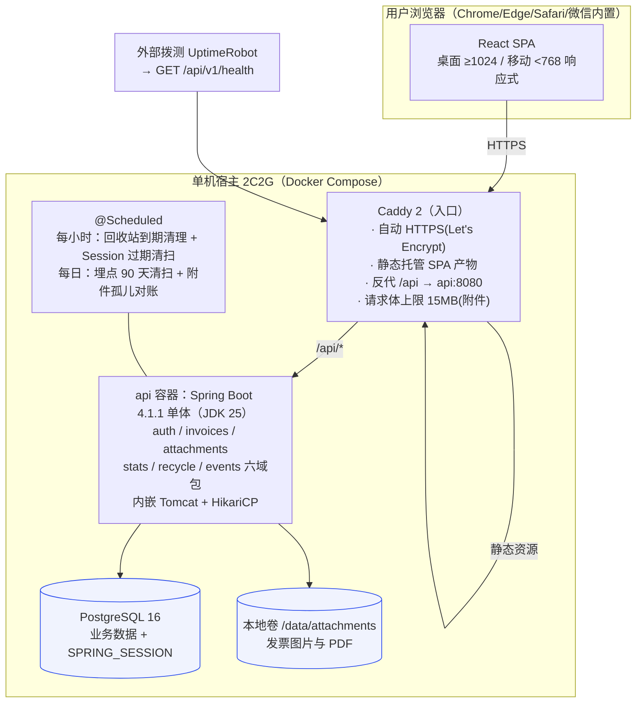
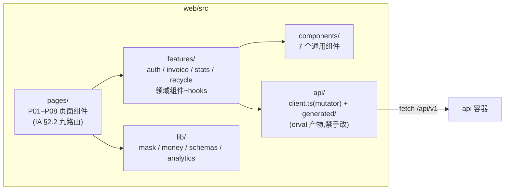
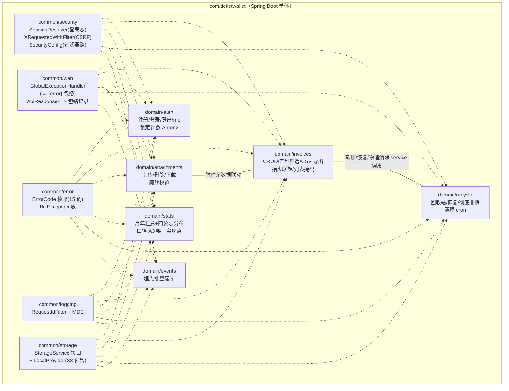
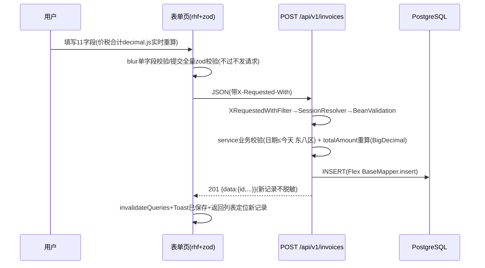
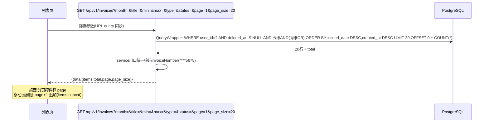

> 来源: P20260914-1728-网页版票夹管理发票/03_engineering/architecture.md | 角色: tech

# 系统架构 —— 票夹通（TicketWallet）

> 文档版本：v2.0 ｜ 撰写日期：2026-09-14 ｜ 撰写角色：tech（技术负责人） ｜ 状态：待评审
> **v2.0：技术栈变更重跑（2026-09-15，用户决策 D6）**——后端实现语言由 NestJS/TypeScript 换为 Spring Boot 4.1.1 + MyBatis-Flex 1.11.8 + JDK 25（Maven 构建）；架构形态（单机单体 + Docker Compose）、数据模型、索引策略、守卫语义、全部关键数据流继承 v1.0，本文按 Java 生态重写模块落点与实现机制。
> 上游依据：`03_engineering/tech-stack.md` v2.0、`01_product/features.md` F01–F15、`02_design/information-architecture.md`、`02_design/interactions.md` R1–R10
> 下游读者：开发实施会话（按 §4 模块认领）、ops（部署拓扑 §2）、qa（数据流与 E2E 映射）

---

## 1. 背景

票夹通的整体架构是**单机单体**：一个 React SPA + 一个 Spring Boot 单体服务 + 一个 PostgreSQL 实例 + 本地附件卷，由 Caddy 统一入口（HTTPS 自动签发、静态托管、`/api` 反代）。v2.0 变更只发生在后端应用内部（Node → JVM）与契约机制（TS 同构 → OpenAPI 单一源），**架构边界、数据模型、安全语义与 v1.0 完全一致**。本文回答三件事：**模块怎么切、数据怎么存、请求怎么流**。

架构必须兑现的硬约束（v1.0 沿用，落点标注 Java 实现处）：

| 约束 | 架构落点（v2.0） |
| --- | --- |
| G2：1000 条内组合筛选 ≤1s | §5.3 索引设计（继承）+ QueryWrapper 单跳查询，无缓存层 |
| G4：账号隔离 | §4.3 所有权谓词纪律——所有业务表查询强制 `user_id` 条件，对象级授权不靠前端 |
| G4：退出后会话立即失效 | §4.4 Spring Session JDBC，登出即删 SPRING_SESSION 行 |
| 回收站 30 天自动清除（F12） | §6.5 @Scheduled 定时任务 + 附件级联物理删除 |
| 越权返回「记录不存在」不暴露存在性（IA §6） | §4.3 统一 404 语义（NotFoundBizException → INV_001） |
| 桌面分页与移动「加载更多」同一 API | §6.2 分页协议 page/page_size 双形态复用 |
| 多会话接力契约漂移防护 | §4.6 OpenAPI 契约链 + CI 三道防线（tech-stack §7） |

## 2. 系统上下文与部署拓扑



要点：

1. **唯一入口 Caddy**：全站 HTTPS 自动完成；SPA 与 API 同源，无跨域 Cookie 问题（继承 v1.0）；
2. **附件上传三道闸**：Caddy body 15MB（一）→ Spring multipart `max-file-size=10MB`（二）→ 扩展名 + 魔数校验（三）；
3. **JVM 资源**：容器 limit 768MB、`MaxRAMPercentage=60`、SerialGC（预算表见 tech-stack §6.2）；api 端口 8080 仅暴露给 Compose 内网；
4. **定时任务**：v1.0 @nestjs/schedule 的等价物为 Spring @Scheduled（单实例单体，无需分布式锁）；Spring Session 过期清扫由 spring-session-jdbc 内置 cron 承担，回收站/埋点/孤儿文件三项为自写 @Scheduled。

## 3. 前端架构（v1.0 继承，契约消费点更新）

### 3.1 分层与目录映射



- 路由表挂载于 `App.tsx`（react-router-dom v7，IA §2.2 九路由 + `RequireAuth` 守卫 + `/login?redirect=` 回跳）；
- **api/ 层是 v2.0 的关键变化**：`generated/` 为 orval 从 `contracts/openapi.json` 生成的类型 + 客户端 + TanStack Query 函数（**禁止手改**）；`client.ts` 作为 orval mutator 注入 `credentials: include`、写接口 `X-Requested-With` 头、401 全局跳转（R9）、`{data}/{error}` 包络解析——包络解析是全站唯一实现点；
- `lib/` 承载横切工具：`mask.ts`（脱敏矩阵唯一实现，`****5678` / `138****1234` / `a***@x.com`）、`money.ts`（decimal.js 两位小数 + 千分位 + 负数红冲 `-2,000.00`）、`schemas/`（手写 zod 表单 schema，中文行内文案 +「≤今天」等前端即时规则，类型与 generated 对齐）、`analytics.ts`（sendBeacon 埋点）、`draft.ts`（断网表单暂存）。

### 3.2 前端状态边界（继承 v1.0）

| 状态 | 归属 | 说明 |
| --- | --- | --- |
| 列表/详情/汇总/回收站数据 | TanStack Query（orval 生成的 query 函数） | 写操作成功后按筛选签名 invalidate——R4「写后以当前条件重拉」 |
| 脱敏偏好 `pref_show_sensitive` | localStorage + Context | 会话间记忆（R8） |
| 表单草稿 | react-hook-form 内存 + sessionStorage | key `draft:invoice:{id|new}`（R3 断网不丢） |
| URL query 筛选/页码 | 路由 searchParams | `?month=2026-08&title=科技&page=2`（R4 刷新/分享不丢） |

## 4. 后端架构（模块划分，Java 实现）

### 4.1 模块图

包根：`com.ticketwallet`（server/src/main/java/com/ticketwallet/）。`common/` 为横切支撑包，`domain/` 下六业务包与 v1.0 六模块一一对应（目录即架构，多会话可按包认领）。



各包内部约定（一包一域、文件自明）：`XxxController`（HTTP 层 + springdoc 注解）、`XxxService`（业务与事务边界）、`XxxMapper extends BaseMapper<T>`（MyBatis-Flex）、`XxxEntity`（表映射）、DTO 记录类（请求/响应，Jackson 序列化）。

### 4.2 各模块职责与关键规则（语义继承 v1.0）

| 模块 | 职责 | 关键规则（对应验收） |
| --- | --- | --- |
| auth | 注册（F01）、登录（F02）、登出（F03）、GET me | 连续 5 次失败 `failed_attempts+1`，第 5 次写 `locked_until=now+10min`；锁定期间正确密码也拒绝（返回剩余分钟）；登录成功清零；密码错误统一「账号或密码错误」；Argon2PasswordEncoder 哈希（BCrypt 降级，前缀共存） |
| invoices | 录入（F04）、编辑（F05）、列表筛选（F07/F08）、CSV 导出（F10）、抬头联想（F15） | 所有查询强制 `user_id = ? AND deleted_at IS NULL`；五维筛选 AND 组合同维 OR（QueryWrapper 动态组装，ILIKE 走 pg_trgm 索引）；导出前 count 预检 >5000 拒绝（EXP_001）；**列表响应 invoiceNumber 服务端掩码 `****5678`** |
| attachments | 上传（F11）、删除、流式下载 | 扩展名 + 魔数双校验；≤10MB；每记录 ≤3 个（DB count 前置校验）；下载校验属主，`Content-Disposition: inline` 预览 |
| stats | 汇总卡（F09） | **口径 A3 单一实现点**：`有效金额 = SUM(CASE status WHEN 正常 THEN total WHEN 红冲 THEN -total ELSE 0 END)`，作废不计金额只计张数；自然月/年边界固定 `Asia/Shanghai` 时区计算 |
| recycle | 回收站列表/恢复/彻底删除（F06/F12） | 按 `deleted_at` 倒序 + `daysLeft = 30 − ⌊(now−deletedAt)/1d⌋` 服务端计算；恢复=置空 deleted_at（列表按开票日期排序，天然回原位）；彻底删除=事务内删行 + 删附件文件 |
| events | 埋点批量写入 | 批量 insert；不含 PII；90 天保留 cron 清理 |

### 4.3 所有权守卫（G4 账号隔离的实现纪律）

NestJS 时代靠 Guard 注解体系；Java 侧**不用注解式对象守卫**（AOP 切面 + 注解的隐式性在多会话接力中易被绕过），改用**显式谓词方法**纪律：

1. **登录态解析**：`common/security/SessionResolver` 从 Spring Session 取当前用户，Controller 以 `@AuthenticationPrincipal`（或等价参数解析器）注入 `CurrentUserId`，未登录由过滤器链直接 401（AUTH_003）；
2. **属主谓词强制**：所有带资源 id 的 service 方法必须形如 `loadOwned(id, userId)`——Mapper 查询条件恒为 `id = ? AND user_id = ?`（attachments 叠加经 invoice 归属或 `user_id` 冗余列双保险，见 §5.1），**查无一律抛 NotFoundBizException → 404 INV_001**（不返回 403，防存在性探测——IA §6）；
3. **列表类强制谓词**：所有列表/汇总/导出/回收站查询的 WHERE 首个条件恒为 `user_id = ?`（QueryWrapper 组装入口统一注入），Code Review 与越权矩阵测试（engineering-plan §4.3）双兜底；
4. **掩码纵深**：`GET /invoices` 的 `invoiceNumber` 在 service 出口统一掩码（保留末 4 位），完整号仅出现在详情、导出 CSV、`show_sensitive=1` 列表——即便响应被抓包，列表载荷也不含全号（继承 v1.0 纵深防御）。

### 4.4 会话机制（Spring Session JDBC）

- 依赖 spring-session-jdbc，会话两表（SPRING_SESSION / SPRING_SESSION_ATTRIBUTE）由官方 schema 初始化；Cookie `tw_session`，`HttpOnly; Secure; SameSite=Lax`；
- 7 天过期（`spring.session.timeout=7d`）+ 内置清理 cron 每小时删过期行；
- 登出：Spring Security logout → session invalidate → **JDBC 删行**，立即失效（继承 v1.0「登出即删行」）；
- CSRF 双保险：SameSite=Lax（浏览器层）+ `XRequestedWithFilter`（应用层，写接口必须携带该头）——不启用 Spring Security CSRF token（契约沿用，理由见 tech-stack §3.5）；
- 会话 ID 熵与降级路径见 tech-stack §3.4（UUID 122bit，防线组合下可接受；256bit 扩展点待核实）。

### 4.5 横切机制落点

| 机制 | Java 实现 |
| --- | --- |
| 响应包络 | `ApiResponse<T>` 记录（成功 `{data}`）；`GlobalExceptionHandler`（@RestControllerAdvice）把 BizException 族与未知异常统一转 `{error:{code,message,details}}`，5xx message 永不泄露堆栈/SQL |
| 金额传输 | Jackson 全局模块：BigDecimal 序列化为 `setScale(2).toPlainString()` 字符串（"4000.00"），反序列化兼容字符串入参 |
| 时间传输 | Jackson JavaTimeModule：`Instant/OffsetDateTime` → ISO 8601 UTC；`issuedDate` 用 `LocalDate`（YYYY-MM-DD）；业务边界计算固定 `ZoneId.of("Asia/Shanghai")` 常量（common/ 时间口径唯一常量） |
| 日志 | logback JSON + MDC requestId；`RequestIdFilter` 生成 id 写入 MDC 并回写 `X-Request-Id` 响应头 |
| 校验 | Controller 入参用 Bean Validation（jakarta validation，@NotBlank/@Pattern/@DecimalMin 等）做**传输层校验**；业务规则（日期 ≤ 今天、号码 8–20 位、每记录附件 ≤3）在 service 复核——前端 zod 规则与 api-design 字段表为同源语义 |

### 4.6 契约链（OpenAPI 单一源，跨会话护栏）

Controller 注解（springdoc @Operation/@Schema）→ 构建期导出 `contracts/openapi.json`（契约工件入库）→ orval 生成 `web/src/api/generated/` → CI 三道防线（契约工件 diff / 生成物 diff / 类型对齐）防漂移。工具链细节与命令见 tech-stack §7，本架构图的要点是：**Controller 注解即契约的书写处，任何接口改动必须走「改注解 → 导出 → 生成 → 提交」四步**，禁止在 generated/ 或 client 之外手写接口调用。

## 5. 数据模型（继承 v1.0，session 表移交 Spring Session）

### 5.1 ER 图

```mermaid
erDiagram
    users ||--o{ invoices : "1:N 账号隔离"
    users ||--o{ events : "埋点"
    invoices ||--o{ attachments : "1:N ≤3 个"
    SPRING_SESSION ||--o{ SPRING_SESSION_ATTRIBUTE : "Spring Session 官方表"

    users {
        uuid id PK
        varchar account "邮箱或手机号(唯一,注册后不可换)"
        smallint accountType "1=email 2=phone"
        varchar passwordHash "argon2id/bcrypt 带算法前缀"
        int failedAttempts "连续失败计数"
        timestamptz lockedUntil "锁定截止"
        timestamptz createdAt
    }
    SPRING_SESSION {
        char primaryId PK "Spring Session 官方 schema"
        char sessionId "会话ID"
        bigint expiryTime "过期清理 cron 使用"
        varchar principalName "关联 users.account"
    }
    invoices {
        uuid id PK
        uuid userId FK
        varchar invoiceCode "选填 ≤20 位数字/字母(数电兼容)"
        varchar invoiceNumber "必填 8-20 位数字"
        date issuedDate "开票日期 ≤今天"
        varchar title "抬头 1-100"
        numeric amount "不含税 12,2 >0"
        numeric taxAmount "税额 12,2 ≥0"
        numeric totalAmount "价税合计=amount+taxAmount 冗余存储"
        varchar category "SPECIAL专票/GENERAL普票"
        varchar medium "ELECTRONIC电子/PAPER纸质"
        varchar status "NORMAL正常/VOIDED作废/REVERSED红冲"
        varchar remark "≤200"
        timestamptz deletedAt "软删除标记, NULL=在夹"
        timestamptz createdAt "编辑保留"
        timestamptz updatedAt
    }
    attachments {
        uuid id PK
        uuid invoiceId FK "级联删除"
        uuid userId FK "冗余,越权双保险"
        varchar filename "展示名"
        varchar mimeType "jpg/png/webp/pdf"
        int size "字节 ≤10MB"
        varchar storageKey "存储抽象层键"
        timestamptz createdAt
    }
    events {
        bigint id PK
        varchar name "invoice_create_success 等"
        varchar reason "失败原因可空"
        uuid userId "可空(注册前事件)"
        varchar dims "筛选维度等 JSON"
        timestamptz createdAt "90 天保留"
    }
```



要点（继承 v1.0 §5.1，差异两条显式说明）：

1. **totalAmount 冗余存储**：金额区间筛选（A4）与汇总直接作用于该列；写入时服务端以 BigDecimal 严格重算 `= amount + taxAmount`，**不信前端**；
2. **红冲语义**：`totalAmount` 存票面正数，汇总 CASE WHEN 取负（仅 stats 模块的单一实现点），列表展示原票面值——IA §4.3；
3. **软删除**：`deletedAt` 非空即回收站态，列表/筛选/汇总/导出一律带 `deleted_at IS NULL`；
4. **差异一（v1.0 → v2.0）**：sessions 表由 Spring Session 官方 SPRING_SESSION/SPRING_SESSION_ATTRIBUTE 接管（tech-stack §3.4），登录锁定仍留在 users 表；
5. **差异二**：category/medium/status 在迁移脚本中优先用 PG enum（DB 层拒绝非法值）；若 MyBatis-Flex 的 enum TypeHandler 与 PG enum 适配不顺（W1 spike 验证），降级 varchar + CHECK 约束，仅改迁移脚本不动 Java 代码。

### 5.2 索引设计（G2 达成路径，继承 v1.0 原样）

```sql
-- 列表/筛选主索引：账号内按开票日期倒序（覆盖排序 + deletedAt 过滤）
CREATE INDEX idx_inv_user_date ON invoices (user_id, issued_date DESC, created_at DESC)
  WHERE deleted_at IS NULL;
-- 抬头 contains 检索（ILIKE '%kw%'）
CREATE EXTENSION pg_trgm;
CREATE INDEX idx_inv_title_trgm ON invoices USING gin (title gin_trgm_ops)
  WHERE deleted_at IS NULL;
-- 金额区间筛选
CREATE INDEX idx_inv_total ON invoices (user_id, total_amount) WHERE deleted_at IS NULL;
-- 回收站倒序
CREATE INDEX idx_inv_recycle ON invoices (user_id, deleted_at DESC) WHERE deleted_at IS NOT NULL;
-- 附件计数前置校验
CREATE INDEX idx_att_invoice ON attachments (invoice_id);
-- 账号唯一
CREATE UNIQUE INDEX uk_users_account ON users (account);
```

以上 DDL 全部入 Flyway `db/migration/V1__init.sql`。**G2 论证（继承）**：单账号 1000 条 + user_id 前缀索引 → 过滤后集 <1000 行，五维 AND 在内存评估，P95 查询 <50ms 量级，叠加 RTT 与渲染远小于 1s 预算——**索引即缓存，无缓存层**。Java 侧的 QueryWrapper 生成的 SQL 形态与 v1.0 Prisma 等价（同为参数化 WHERE + LIMIT/OFFSET），索引选择性不受实现语言影响。

## 6. 关键数据流

### 6.1 录入保存（R3 正常流，G1）



### 6.2 列表筛选与分页（R4，双端同一 API）



### 6.3 CSV 导出（R6，G3）

```mermaid
sequenceDiagram
    participant FE as 列表/汇总页
    participant C as GET /api/v1/invoices/export
    participant API as invoices 模块
    participant DB as PostgreSQL
    FE->>API: 导出(当前筛选参数,credentials include)
    API->>DB: COUNT 预检
    alt count > 5000
        API-->>FE: 422 EXP_001(前端弹窗引导按月筛选)
    else ≤5000
        API->>API: StreamingResponseBody: 首写BOM(\uFEFF)
        loop id游标分批(500/批)
            API->>DB: SELECT … WHERE … AND id>游标 ORDER BY id LIMIT 500
            API->>API: CSV转义(逗号/引号/换行)+写出(不脱敏,列序=F10)
        end
        API-->>FE: 200 text/csv; charset=utf-8(流)
        FE->>FE: Blob下载 票夹通导出_YYYYMMDD_HHmmss.csv
    end
```

### 6.4 附件上传（R7）

选择文件 → 前端即时三检（扩展名/大小/已挂数量）不过不发请求 → `POST /invoices/:id/attachments`（multipart）→ Spring multipart 落临时文件（≤10MB 由配置二道闸拦截）→ 魔数嗅探（JPEG `FFD8FF`/PNG `89504E47`/WEBP `RIFF…WEBP`/PDF `%PDF-`）+ 扩展名白名单 → `StorageService.put(storageKey)` 写本地卷 → DB INSERT（属主谓词先校验记录归属）。失败项前端标红重试，**记录本体与其他附件不受影响**（每次上传独立请求）。storageKey 生成规则：`{userId}/{invoiceId}/{uuid}.{ext}`（按用户分目录，便于对账与整目录迁移）。

### 6.5 回收站到期清理（每小时 @Scheduled，F12）

```mermaid
flowchart LR
    A[每小时: 扫描 deleted_at < now-30d] --> B{命中?}
    B -- 否 --> Z[结束]
    B -- 是 --> C[事务: 查附件storageKeys + 删DB行(级联附件行)]
    C --> D[StorageService.delete 逐个删文件]
    D --> E[日志记录清除数量/耗时/requestId]
    E --> F[孤儿文件对账cron每日兜底<br/>扫描目录中无DB行的storageKey]
```

顺序决策（继承 v1.0）：**先删 DB 行后删文件**——中途失败留下孤儿文件，由每日对账 cron 兜底清理；反过来会留下「无文件附件行」破坏 DB 完整性。文件可重建性差、DB 行完整性优先。

### 6.6 会话与 401 全局拦截（R9）

任意 API 401（AUTH_003）→ 前端 `client.ts`（orval mutator）统一拦截：Toast「登录已过期」→ 1s 后跳 `/login?redirect=当前URL`；浏览器 offline 事件 → 顶部警示条常驻。后端侧 Spring Session 过期/删除行后，后续请求在过滤器链即被拒， Controller 不会执行——401 路径零业务代码。

## 7. 横切关注点汇总

| 关注点 | 方案 | 落点 |
| --- | --- | --- |
| 鉴权 | Spring Session JDBC + SessionResolver + 属主谓词纪律 | server common/security + 各 domain service |
| 契约 | OpenAPI 注解 → 契约工件 → orval 生成 → CI 三道防线 | server Controller 注解 / contracts/ / web api/generated |
| 校验 | Bean Validation（传输层）+ service 业务复核 + 前端 zod（文案与即时反馈） | 各层分工如 §4.5 |
| 脱敏 | 服务端列表掩码 + 前端 mask.ts + localStorage 偏好 | invoices service 出口 / web lib/mask.ts |
| 错误 | GlobalExceptionHandler → `{code,message,details}`（15 错误码枚举） | server common/web + common/error |
| 埋点 | 前端 sendBeacon → /events → 90 天保留 cron | web lib/analytics.ts + server domain/events |
| 日志 | logback JSON + MDC requestId（X-Request-Id 回写） | server common/logging |
| 时区 | 业务口径固定 Asia/Shanghai（汇总边界、日期 ≤ 今天） | server common 时间常量 + stats/invoices |
| 金额 | BigDecimal 端到端 + Jackson 两位小数字符串序列化 | server common/web + PG numeric(12,2) |

## 8. 验收标准与后续行动

### 8.1 验收标准

- [x] 部署拓扑、前后端模块、数据模型、六条关键数据流均有 mermaid 图与文字规则，模块图与 repo-layout 目录一一对应（§3.1/§4.1）
- [x] G2（§5.2 索引继承论证）、G4（§4.3 显式谓词纪律 + §4.4 会话删行）、F12（§6.5）、双端分页（§6.2）硬约束逐条落位
- [x] v1.0 继承项（ER/索引/404 语义/掩码/导出流式）与 v2.0 变化项（Spring Session 表、enum 降级预案、契约链）显式区分
- [x] Java 侧实现机制（QueryWrapper、@RestControllerAdvice、Jackson 定制、@Scheduled、Testcontainers 素材）与 tech-stack 选型互链无冲突
- [x] 口径 A3 仍收敛为 stats 模块单一实现点

### 8.2 后续行动

1. repo-layout.md 按本文模块图物化目录树（≤30 目录，Java 包结构 + pnpm 前端区 + contracts + deploy 四区）；
2. api-design.md 以本文数据流为骨架落 22 接口契约与 15 错误码（语义 100% 继承 v1.0）；
3. M1 W1 spike 验证 §3.3/§5.1 差异二（Flex enum TypeHandler、ILIKE 条件）后回填本文档标注。
