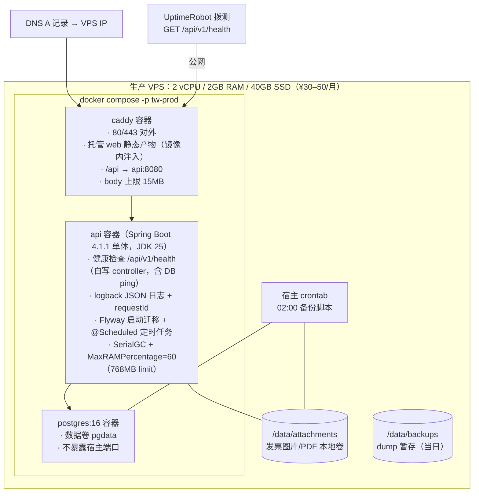

> 来源: P20260914-1728-网页版票夹管理发票/04_ops/deployment.md | 角色: ops

# 部署方案 —— 票夹通（TicketWallet）

> 文档版本：v1.1 ｜ 撰写日期：2026-09-14 ｜ 撰写角色：ops（运维负责人） ｜ 状态：待评审
> **v1.1：技术栈变更对齐（2026-09-15，D6）**——后端由 NestJS（Node，api:3000）换 Spring Boot 4.1.1 + JDK 25（api:8080）：api 镜像改 Maven 多阶段构建（temurin-25-jre-alpine + 分层 jar）、内存预算对齐（limit 768MB / RSS ≤550MB / 镜像 <350MB）、迁移由 Prisma 换 Flyway（随 api 启动执行）；三环境划分、12 步上线流程与三层回滚框架不变。
> 上游依据：`03_engineering/architecture.md` §2（部署拓扑，v2.0）、`03_engineering/tech-stack.md` §6（基础设施与 JVM/镜像预算，v2.0）、`03_engineering/engineering-plan.md` §5/§6（CD 与回滚，v2.0）、`03_engineering/repo-layout.md` §3（deploy/ 目录职责）
> 下游读者：开发实施会话（M3 W5 部署任务执行）、support（故障排查时的环境口径）

---

## 1. 背景

票夹通为单机单体的网页版发票票夹：**1 台 VPS 承载全部生产负载**，Docker Compose 编排，Caddy 统一入口（自动 HTTPS + 静态托管 + `/api` 反代），PostgreSQL 16 与附件本地卷同机。本文回答四件事：**环境怎么分、机器上怎么摆、怎么上线、出问题怎么退回去**。

部署必须兑现的硬约束（源自章程与前序阶段）：

| 约束 | 部署落点 |
| --- | --- |
| M3 里程碑 = 生产部署 + 监控告警 + 备份演练 | §4 上线步骤覆盖三者（监控详见 monitoring.md、备份详见 backup-dr.md） |
| G4：全站 HTTPS、传输加密 | Caddy ACME 自动签发，§4 步骤 1 提前解析 DNS 保障签发成功率 |
| 单机可落地为底线，云托管优先 | §3 单 VPS 方案为基线，§6 给出向云托管迁移的触发条件 |
| 月成本目标 ≤ ¥50（tech-stack T5） | §3 规格选型控制在 ¥30–50/月，监控与备份用免费层级 |
| 应用回滚 RTO ≤5 分钟（engineering-plan §6.2） | §5 三层回滚步骤化 |

## 2. 环境划分

### 2.1 三环境总表

| 环境 | 用途 | 形态 | 数据策略 | 访问入口 |
| --- | --- | --- | --- | --- |
| **dev（本地开发）** | M1–M2 迭代、E2E 运行 | 开发者本机：`docker compose -f deploy/compose.yaml --profile dev`（Vite 热重载 + Spring Boot dev（mvnw 本地运行，8080）+ 测试 PG） | 测试 PG 每用例 truncate；**禁止录入真实发票数据** | `http://localhost:5173`（Vite dev server 直连本地 api:8080） |
| **staging（试运行）** | M3 W6 试运行、上线前预演、生产问题复现 | 与生产**同 VPS、独立 compose project**（project name `tw-staging`），独立 PG 实例（端口 54329）与独立附件卷 `/data/staging-attachments`，独立域名 `staging.<域名>`（Caddy 同机多站点） | 仅脱敏/造数数据；与生产卷、生产库**物理隔离** | `https://staging.<域名>` |
| **prod（生产）** | 对外服务 | 单 VPS Compose 全栈（§3） | 真实数据，纳入每日备份 | `https://<域名>` |

要点：

1. staging 与生产同机是为守住 ≤¥50/月成本底线；两者通过 compose project name、端口、卷路径三重隔离，**staging 故障最多自伤，不波及生产**（资源限额见 §3.3）；
2. M3 W6 的「7 天真实数据试运行」在**生产环境**进行（真实用户即灰度，见 cicd.md §5 发布策略），staging 承担上线前最后预演；
3. 环境差异只允许通过 `.env` 与 `--profile` 表达，`compose.yaml` 单一文件版本化于 git（配置回滚即 checkout，见 §5.3）。

### 2.2 环境配置矩阵

| 配置项 | dev | staging | prod |
| --- | --- | --- | --- |
| TLS | 无（HTTP） | Caddy ACME（staging 子域名） | Caddy ACME（主域名） |
| 日志级别 | debug | info | info（生产排障可临时调 debug，≤2h 恢复） |
| 埋点上报 | 本地 api | staging api | 生产 api |
| 备份 cron | 无 | 无 | 每日 02:00（backup-dr.md §3） |
| 拨测 | 无 | 无 | UptimeRobot 5 分钟间隔 |
| PG 端口（宿主） | 54329（仅本机） | 54329（仅 127.0.0.1） | **不映射宿主**（仅 compose 网络内） |

## 3. 生产部署架构

### 3.1 拓扑与规格

说明：

1. **常驻容器 3 个**（caddy / api / postgres），与 tech-stack v2.0 §6.1「三容器」口径一致；web 静态产物为构建期镜像（`deploy/docker/web.Dockerfile` 产物注入 caddy 镜像），运行时无独立 web 容器；
2. **api 镜像构建（v1.1 对齐）**：多阶段 Docker 构建——`maven:3.9-eclipse-temurin-25` 构建层执行 `./mvnw package`，`eclipse-temurin:25-jre-alpine` 为运行层，Spring Boot 分层 jar（layertools extract）缓存依赖层；目标镜像 <350MB、运行 RSS ≤550MB（tech-stack §6.2 预算）；JVM 参数 `-XX:MaxRAMPercentage=60 -XX:+UseSerialGC`；**JDK 21 回退位**：W1 spike 失败时基座换 `temurin-21-jre-alpine`（pom `<java.version>` 联动），发布流程不变（engineering-plan §6.2）；
3. 附件卷 `/data/attachments` 与 pgdata 卷均为**命名卷/绑定目录**，发布重建容器时数据不动（发布不丢数据的第一保障）；
4. 宿主目录规划：`/opt/ticketwallet/`（compose 与配置）、`/data/attachments/`、`/data/staging-attachments/`、`/data/backups/`。

### 3.2 网络与安全基线

1. 云防火墙/ufw 仅放行 `22`（SSH，建议限源 IP）、`80`、`443`；PG 与 api 端口一律不对公网暴露；
2. SSH 禁用密码登录（仅密钥），安装 fail2ban（maxretry 5 / bantime 1h）；
3. 时区固定 `Asia/Shanghai`（备份窗口、cron 口径均按东八区）；
4. `.env` 权限 `600`，内容：`SPRING_DATASOURCE_*`（PG 连接与强口令）、`SPRING_SESSION_TIMEOUT` 等会话配置、备份目标凭证；会话数据由 Spring Session JDBC 落 PG（SPRING_SESSION 表）管理，**不再有应用侧 session 盐**；`.env` 不入库（CI 白名单校验，见 cicd.md §3.3）。

### 3.3 资源限额（防 staging 与生产互抢）

| 容器 | 内存限额 | 说明 |
| --- | --- | --- |
| caddy | 256MB | 静态+反代，足够 |
| api（prod） | 768MB | JVM：`-XX:MaxRAMPercentage=60`（堆 ≈460MB）+ `-XX:+UseSerialGC`；RSS 目标 ≤550MB（tech-stack §6.2 预算），argon2 哈希与 10MB 上传峰值余量已计入 |
| postgres（prod） | 640MB | shared_buffers 128MB、max_connections 30（api 侧 HikariCP 池 10） |
| staging 全套 | 合计 ≤512MB | 超限即重启，不影响生产 |

## 4. 上线步骤（M3 W5，从零到生产）

按序执行，每步有验证点，任一步失败停止并按 §5 回退：

1. **DNS 预解析**：主域名与 `staging.` 子域名 A 记录指向 VPS IP，TTL 600；等待生效（`dig +short <域名>` 返回 VPS IP）。提前 24h 操作，保障 ACME 签发时域名已可解析。
2. **服务器初始化**：创建非 root 运维用户（sudo）；安装 Docker Engine + compose plugin；ufw 放行 22/80/443；fail2ban；`timedatectl set-timezone Asia/Shanghai`；开启 unattended-upgrades 安全更新。
3. **落位部署物**：`git clone` 生产仓库至 `/opt/ticketwallet`（或解包发布产物）；创建 `/data/attachments`、`/data/backups` 目录（属主对齐容器用户）。
4. **渲染配置**：按 `.env.example` 生成生产 `.env`（DB 强口令 32+ 位随机、`SPRING_DATASOURCE_*` 与 `SPRING_SESSION_TIMEOUT`、备份凭证）；`chmod 600 .env`；核对 Caddyfile 域名与 `/api → api:8080` 反代目标。
5. **拉取镜像并启动存储层**：`docker compose -p tw-prod pull`；`docker compose -p tw-prod up -d postgres`；等待健康（`pg_isready` 通过）。
6. **执行迁移（Flyway 随 api 启动）**：`docker compose -p tw-prod up -d api`（api:8080 仅 compose 内网可达，此时公网未放通）；`docker logs -f tw-api` 确认 Flyway 输出 `Successfully applied N migrations`；失败则**停止上线**，按 §5.2 数据回退处置（**生产永久禁用 `flyway clean`**，schema_history 只增不删，engineering-plan §6.2）。
7. **启动全栈**：`docker compose -p tw-prod up -d`（拉起 caddy，对外放通）；`docker compose ps` 三容器均 healthy。
8. **功能冒烟（staging 先行同步骤）**：注册 → 登录 → 录入一条测试发票 → 列表筛选 → 删除进回收站 → 恢复，全链路 200/204；CSV 导出文件可下载且 BOM 首字节正确。
9. **安全核验（G4）**：`curl -v https://<域名>` 证书有效；浏览器抓包确认列表响应 `invoiceNumber` 为 `****5678` 掩码态；Cookie 属性 `HttpOnly; Secure; SameSite=Lax`。
10. **接入拨测**：UptimeRobot 添加 `GET https://<域名>/api/v1/health`（5 分钟间隔），配置告警通道（monitoring.md §5）。
11. **接入备份**：部署备份脚本与宿主 crontab（backup-dr.md §3），**手动触发一次**并验证异机可下载。
12. **上线记录**：填写上线签发单（版本 tag、Flyway 迁移版本（`flyway_schema_history` 最新 V* 脚本）、冒烟结果、备份文件名），归档至项目 wiki，进入 M3 W6 试运行。

## 5. 回滚步骤

### 5.1 应用回滚（RTO ≤5 分钟）

适用：发布引入 P0 缺陷且 15 分钟内无法修复（回滚决策口径见 engineering-plan §6.2 第 4 条）。

1. 确认回退目标 tag（生产保留**最近 3 个镜像 tag**，`docker images | grep tw-api`）；
2. 修改 `/opt/ticketwallet/.env` 中 `API_IMAGE_TAG=<上一 tag>`、`WEB_IMAGE_TAG=<上一 tag>`；
3. `docker compose -p tw-prod up -d`（仅重建 api/caddy 容器，PG 与数据卷不动）；
4. 验证：`curl -f https://<域名>/api/v1/health` 200 + 登录冒烟；
5. 在 issue 中记录回滚原因，修复后重新走发布流程。

### 5.2 数据回滚（迁移失败场景）

1. 部署流水线在每次发布前**自动 `pg_dump`**（pre-deploy dump，cicd.md §5.2 步骤 3），迁移失败时取该份 dump；
2. Flyway 无 `migrate resolve` 等价物，标准动作为「**恢复 dump + 修复迁移脚本 + 重放**」（engineering-plan §6.2）：停 api 容器 → 修复 `V*.sql` 脚本并出新镜像 tag → `pg_restore -c -d <db> /data/backups/pre-deploy-{tag}.dump` → 以修复后镜像重新部署，Flyway 重放迁移；
3. 若迁移已半提交破坏结构：同上恢复 dump → 回退应用镜像至上一 tag（其迁移版本与 dump schema 匹配）→ 重启验证；
4. 全程不超过 RTO 2h 预算（backup-dr.md §2），事后必须复盘为何迁移未经 staging 验证。

### 5.3 配置回滚

Caddyfile 与 `.env.example`、compose.yaml 均版本化于 git：`git checkout <历史版本> -- deploy/` 重新渲染后 `up -d`。`.env` 中的密钥值不做 git 回滚（防密钥回退到已泄露值），仅回滚结构模板。

## 6. 云托管演进路径（非本期范围）

触发条件（满足其一再评估）：单机连续两次季度演练超 RTO、月活超出单账号台账定位、VPS 所在可用区故障。迁移顺序：附件卷 → S3Provider（StorageService 抽象，业务零改动）→ PG → 云数据库（pg_dump 导入）→ 计算层 → 容器托管。当前**不做双机热备**（成本与规模不配，违反 T1）。

## 7. 验收标准与后续行动

### 7.1 验收标准

- [x] dev / staging / prod 三环境划分、隔离手段、配置矩阵明确（§2）
- [x] 生产拓扑与 architecture.md §2 一致（caddy/api/pg + 双数据卷），资源与成本量化（§3）
- [x] 上线 12 步含验证点与安全核验，可按序执行（§4）
- [x] 应用/数据/配置三层回滚步骤化，应用回滚 RTO ≤5 分钟（§5）

### 7.2 后续行动

1. M3 W5 开工前，开发会话补齐 `deploy/compose.yaml` 的 healthcheck 与资源限额定义（本文 §3.3 数值）；
2. ops 在 M3 W5 按 §4 实操一次全量上线，把实际耗时与坑位回填本文；
3. staging 环境在 M2 结束前建成（提前于 M3，供 deploy 编排预演——engineering-plan §2.2 并行说明）。
